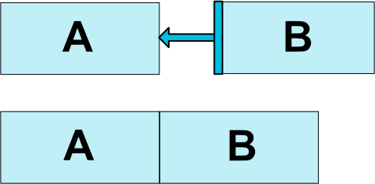
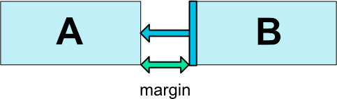
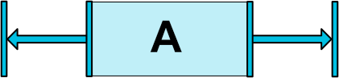
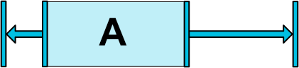
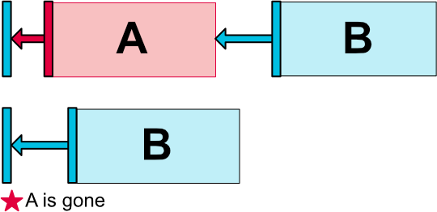
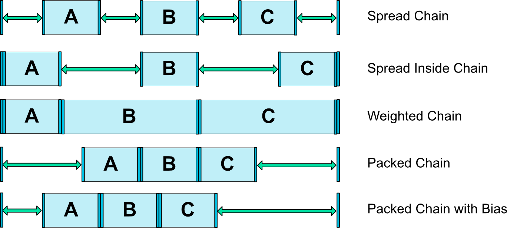

## ConstraintLayout


`ConstraintLayout`是一个让控件摆放排列更灵活的布局。

>注意: `ConstraintLayout`可以作为支持库，您可以使用Android系统从API级别9(Gingerbread)。因此，我们计划在丰富其API和功能。这个文档将反映这些变化。

目前你可以使用下面这些类型的限制:
- <a href="#RelativePositioning">相对定位</a>
- <a href="#Margins">Margins</a>
- <a href="#CenteringPositioning">中心定位</a></a>
- <a href="#CircularPositioning">圆形定位</a></a>
- <a href="#VisibilityBehavior">可见性行为</a></a>
- <a href="#DimensionConstraints">尺寸约束</a></a>
- <a href="#Chains">链</a></a>
- <a href="#VirtualHelpersObjects">虚拟助手对象</a></a>
- <a href="#Optimizer">优化器</a>

>注意：在约束条件下不能有循环依赖关系。

参见[ConstraintLayout.LayoutParams](https://developer.android.com/reference/android/support/constraint/ConstraintLayout.LayoutParams.html)的布局属性

### <a name="RelativePositioning">相对定位</a>
相对定位是在`ConstraintLayout`创建布局的基本构建块。这些约束允许您将给定的控件与另一个相对应。你可以在水平轴和垂直轴上约束控件:
- 水平轴: left，right，start 和 end
- 垂直轴: top，bottom 和 baseline

一般的概念是将一个控件的一个侧面约束到另一个控件的另一侧。

例如，为了将按钮B放在按钮A的右边(图1):

图1 - 相对布局例子
你只需要做:
```xml
<Button android:id="@+id/buttonA" ... />
<Button android:id="@+id/buttonB" ...
        app:layout_constraintLeft_toRightOf="@+id/buttonA" />
```
这是告诉系统我们想要按钮B的左边被约束在按钮A的右侧。这样一个位置约束意味着系统将尝试双方共享相同的位置。

图2 - Relative Positioning Constraints

下面是一些可用的约束属性(图2):
- `layout_constraintLeft_toLeftOf`
- `layout_constraintLeft_toRightOf`
- `layout_constraintRight_toLeftOf`
- `layout_constraintRight_toRightOf`
- `layout_constraintTop_toTopOf`
- `layout_constraintTop_toBottomOf`
- `layout_constraintBottom_toTopOf`
- `layout_constraintBottom_toBottomOf`
- `layout_constraintBaseline_toBaselineOf`
- `layout_constraintStart_toEndOf`
- `layout_constraintStart_toStartOf`
- `layout_constraintEnd_toStartOf`
- `layout_constraintEnd_toEndOf`

他们都通过id引用到另一个控件，或`parent`(引用父容器，即`ConstraintLayout`):
```xml
<Button android:id="@+id/buttonB" ...
        app:layout_constraintLeft_toLeftOf="parent" />
```

### <a name="Margins">Margins</a>

图3 - 相对布局Margins

如果设置了margin，他们将被应用到相应的约束(如果存在的话)(图3)，保证margin作为目标和源控件之间的空间。通常可用于这种效果的布局margin属性:
- `android:layout_marginStart`
- `android:layout_marginEnd`
- `android:layout_marginLeft`
- `android:layout_marginTop`
- `android:layout_marginRight`
- `android:layout_marginBottom`

>注意： margin只能是大于或等于0的数.

##### 使用margin连接到一个GONE的控件
当约束的目标控件的可见属性是GONE，就需要使用另外一批属性：
- `layout_goneMarginStart`
- `layout_goneMarginEnd`
- `layout_goneMarginLeft`
- `layout_goneMarginTop`
- `layout_goneMarginRight`
- `layout_goneMarginBottom`

### <a name="CenteringPositioning">中心定位和偏移</a>
`ConstraintLayout`有一个很有用的特性是如何处理“不可能”的约束。例如:
```xml
<android.support.constraint.ConstraintLayout ...>
  	<Button android:id="@+id/button" ...
          	app:layout_constraintLeft_toLeftOf="parent"
          	app:layout_constraintRight_toRightOf="parent" />
</>
```

除非`ConstraintLayout`恰好有相同大小的按钮，两个约束不能同时满足(双方都不能在我们期望的位置)。

图4 - 中心定位
在这种情况下会发生的是，约束像相反且相等的力量将控件分开(图4)；这样部件最终将被放置在父容器的中间。这将同样适用于垂直约束。

##### 偏移
默认情况下，遇到这样的相反的约束是将控件居中；但是你可以调整定位倾向一方使用偏差属性:
- `layout_constraintHorizontal_bias`
- `layout_constraintVertical_bias`

图5 - 中心定位与偏移

下面的例子展示了左边偏移30%(默认是偏移50%居中)，这样左边会更窄，控件更倾向于左边(图5):
```xml
<android.support.constraint.ConstraintLayout ...>
	<Button android:id="@+id/button" ...
            app:layout_constraintHorizontal_bias="0.3"
            app:layout_constraintLeft_toLeftOf="parent"
            app:layout_constraintRight_toRightOf="parent"/>
</>
```
使用偏差，您可以创建用户界面，将更好的适应屏幕大小变化。


### <a href="CircularPositioning">圆形布局</a> (Added in 1.1)
你可以限制一个控件中心相对于另一个控件中心，在一个角度和距离。这允许您将控件摆放在一个圆上(见图6)，可以使用以下属性:
- `layout_constraintCircle` : 引用另一个控件的id
- `layout_constraintCircleRadius` : 到圆心的距离
- `layout_constraintCircleAngle` : 控件摆放的角度(角度：从 0 到 360)


Fig. 6 - 圆形布局

```xml
<Button android:id="@+id/buttonA" ... />
	<Button android:id="@+id/buttonB" ...
			app:layout_constraintCircle="@+id/buttonA"
			app:layout_constraintCircleRadius="100dp"
			app:layout_constraintCircleAngle="45" />
```

### <a href="VisibilityBehavior">可见性行为</a>
当控件被设置为`View.GONE`时，`ConstraintLayout`都有一个特定的处理。

跟通常情况一样，GONE控件不会被显示，并且不是布局本身的一部分（即标记为GONE后实际尺寸不会改变）。

但在计算布局方面，GONE控件仍然是它的一部分，一个重要的区别:
- 在layout之后，这些控件的尺寸被视是0 (基本上，控件将会当作一个点处理)
- 如果他们有其他控件有约束，这些控件仍然会生效，但任何margin将等于零

图7 - 可见性行为

这个特定行为允许你在构建布局，可以暂时隐藏控件而不破坏其他布局(图7)，在做简单布局动画时特别有用。

>注意：所使用的margin将是B在连接到A时定义的margin(请参见图7)。在某些情况下，这可能不是你想要的margin(如A距离父容器有100dp的margin，B距离A只有16dp的margin，把A标记为GONE后，B将距离父容器16dp)。出于这个原因，当一个被依赖的控件被标记为GONE时，您可以指定一个替代margin值(请参阅前面一节关于GONE Margin属性)。


### <a href="DimensionConstraints">尺寸约束</a>
`ConstraintLayout`的最小尺寸
你可以为 `ConstraintLayout` 指定最大和最小尺寸:
 - `android:minWidth` 设置布局最小宽度
 - `android:minHeight` 设置布局最小高度
 - `android:maxWidth` 设置布局最大宽度
 - `android:maxHeight` 设置布局最大高度

这些最大和最小尺寸将在 `ConstraintLayout` 被设置为 `WRAP_CONTENT` 时生效。


##### 控件尺寸约束
控件的尺寸可以有三种不同的方式去设置 `android:layout_width` 和 `android:layout_height` :
 - 使用固定尺寸 (一个数值如 123dp 或者 尺寸引用)
 - 使用 `WRAP_CONTENT`， 让每个控件计算自己的尺寸
 - 使用 0dp，等同于 `MATCH_CONSTRAINT`

图8 - 尺寸约束

前两个选项与其他布局一样使用。最后一个则是让控件适应布局的约束尺寸 (见图8， (a) 是 wrap_content，(b) 是 0dp)。如果设置了margin，则也会计算在内 (Fig. 8， (c) 是 0dp).

重要: `ConstraintLayout`的子控件不推荐使用`MATCH_PARENT`。使用 `MATCH_CONSTRAINT` 也可以达到与父控件上下左右对齐的效果。

WRAP_CONTENT : 强制约束 (版本1.1添加)

如果尺寸设置为 `WRAP_CONTENT`，在版本 1.1 之前 控件的尺寸将使用实际尺寸 -- 意思是， 约束并不会限制最终的尺寸。虽然一般来说这是足够的(快)，在某些情况下，您可能希望使用`WRAP_CONTENT`，然而保持强制约束限制的尺寸。在这种情况下，您可以添加一个相应的属性:
 - `app:layout_constrainedWidth=”true|false”`
 - `app:layout_constrainedHeight=”true|false”`

`MATCH_CONSTRAINT` 尺寸 (版本1.1添加)
当尺寸设置为 `MATCH_CONSTRAINT`， 默认行为是产生的大小采取一切可用的空间。几个额外的修饰符是可用的:
 - `layout_constraintWidth_min` 和 `layout_constraintHeight_min` : 设置最小尺寸
 - `layout_constraintWidth_max` 和 `layout_constraintHeight_max` : 设置最大尺寸
 - `layout_constraintWidth_percent` 和 `layout_constraintHeight_percent` : 按父控件的百分比设置尺寸

###### 最小 and 最大
最小和最大尺寸可以使用dp值指定，或者 "wrap"(与`WRAP_CONTENT`效果类似)。

##### 百分比尺寸
如果要使用百分比布局，你需要使用下面的设置：
 - 尺寸设置为 `MATCH_CONSTRAINT` (0dp)
 - 默认应该设置为百分比 `app:layout_constraintWidth_default="percent"` or `app:layout_constraintHeight_default="percent"`
(注意: 在版本 1.1-beta1 and 1.1-beta2 是必须的， 但在后续的版本中定义了百分比属性后则是不需要的)
 - 然后设置 `layout_constraintWidth_percent` 或 `layout_constraintHeight_percent` 属性，范围为： 0 到 1

##### 比例
你也可以使用一个控件的尺寸的比例设置另一个尺寸。为了做到这一点，你需要至少有一个有约束寸尺被设置为0dp(即`MATCH_CONSTRAINT`)，并设置属性`layout_constraintDimensionRatio`指定比例。例如:
```xml
<Button android:layout_width="wrap_content"
        android:layout_height="0dp"
        app:layout_constraintDimensionRatio="1:1" />
```

将按钮的高度设置为与宽度的比例为1:1。

这个比例可以表达为:
 - 一个 float 值，代表宽度和高度之间的比例
 - 一个比值 "width:height"

如果两个尺寸都设置为`MATCH_CONSTRAINT`(0 dp)，你也是可以使用比例。在这种情况下，在满足所有约束和维护指定的长宽比的前提下，系统会设置一个最大的尺寸。根据另一个维度约束一个特定的边，你可以附加W或H，分别限制宽度或高度。举个例子，如果一个维度由两个属性约束(如宽度为0dp并且在父布局居中)可以指明哪一个属性应该约束，通过添加字母W(对于限制宽度)或H(限制高度)的比率，用逗号分开:
```xml
<Button android:layout_width="0dp"
        android:layout_height="0dp"
        app:layout_constraintDimensionRatio="H，16:9"
        app:layout_constraintBottom_toBottomOf="parent"
        app:layout_constraintTop_toTopOf="parent"/>
```

将按钮的高度设置后一个16:9的高度，而按钮的宽度将匹配父容器的约束。


### <a href="#Chains">链</a>
`Chains` 提供类似组(group-like)的行为在一个轴(axis)(横向或纵向)。其他轴可以独立约束。

##### 创建一个链
一组控件通过双向链连接在一起，则他们被认为是一个链(参见图9，显示两个控件组成的最小链，)。


图9 - Chain

##### 链首（Chain Head）
链是由链集合的第一个元素(链首)的属性控制:

图 10 - Chain Head
左边第一个的控件是水平链的链首，最顶部的控件是垂直链的链首。

##### Margins in chains
如果margin上指定的连接，它们将被考虑在内。在展开链的情况下，margin将被去除分配的空间。

##### 链的样式
当给链头设置属性 `layout_constraintHorizontal_chainStyle` 或 `layout_constraintVertical_chainStyle` 时，链的行为会改变根据指定的样式(缺省为`CHAIN_SPREAD`)。.

 - `CHAIN_SPREAD` -- 元素将均匀分散 (默认样式)
 - `CHAIN_SPREAD`模式的权重链（Weighted chain），如果有控件设置为 `MATCH_CONSTRAINT`，它们将分割可用空间
 - `CHAIN_SPREAD_INSIDE` -- 类似，但链式的端点不会散开
 - `CHAIN_PACKED` -- 链的元素将被打包在一起。孩子的水平或垂直偏差属性将影响包装元素的位置


图11 - Chains Styles


##### 权重链
链的默认行为是让元素均匀分布在可用空间。如果一个或多个元素使用`MATCH_CONSTRAINT`，他们将利用可用空间(他们之间平分)。属性`layout_constraintHorizontal_weight`和 `layout_constraintVertical_weight`将控制如何把 使用了`MATCH_CONSTRAINT`的元素 分布在空间。例如，链中包含两个使用了`MATCH_CONSTRAINT`的元素，第一个元素使用的权重为2，第二个元素的权重为1，第一个元素占用的空间将是第二个元素的两倍。

##### Margins and 链 (in 1.1)
当链中的元素使用margin时，margin是附加的。

例如，在一个水平链中，如果一个元素定义右边距为 10dp， 接下来的元素定义左边距为 5dp，则这两个元素的间距就是15dp.

在计算剩余空间时，元素的尺寸和margin被打包在一起计算的。剩下的空间不包含元素间的间距。


### <a href="VirtualHelpersObjects">虚拟助手对象</a>
除了刚才详细描述的原有功能，你还可以在`ConstraintLayout`中使用特殊的helper对象来帮助你布局。目前，`Guideline`对象允许您创建水平和垂直参考线来摆放在于`ConstraintLayout`容器的相对位置。控件在布局定位时可以使用guidelines来约束。在1.1中，`Barrier`和`Group`被添加。


### <a href="Optimizer">优化器</a> (in 1.1)
在1.1中我们接触约束优化器。你可以通过添加标签`layout_optimizationLevel`，来指定优化哪些`ConstraintLayout`元素:
 - `none` : 不使用优化器
 - `standard` : 默认. 只优化direct 和 barrier
 - `direct` : 只优化direct约束
 - `barrier` : 只优化barrier约束
 - `chain` : 优化链约束 (试验功能)
 - `dimensions` : 优化尺寸约束 (试验)， 减少匹配到的元素的测量次数

这个属性是一个掩码(mask)，所以你可以通过列表决定打开或关闭你想要的优化。 例如: `app:layout_optimizationLevel="direct|barrier|chain"`


------------------
[ConstraintLayout](https://developer.android.com/reference/android/support/constraint/ConstraintLayout)
[Android新特性介绍，ConstraintLayout完全解析](https://blog.csdn.net/guolin_blog/article/details/53122387)


