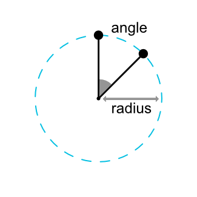
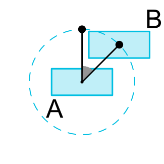
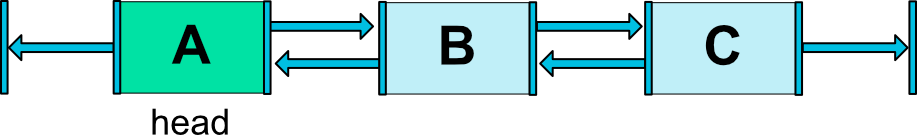

## ConstraintLayout


`ConstraintLayout`是一个让控件摆放排列更灵活的布局。

>Note: `ConstraintLayout`可以作为支持库,您可以使用Android系统从API级别9(Gingerbread)。因此,我们计划在丰富其API和功能。这个文档将反映这些变化。

目前你可以使用下面这些类型的限制:
- Relative positioning
- Margins
- Centering positioning
- Circular positioning
- Visibility behavior
- Dimension constraints
- Chains
- Virtual Helpers objects
- Optimizer

注意，不能有循环依赖约束。

Also see ConstraintLayout.LayoutParams for layout attributes

### 相对布局
相对布局是在`ConstraintLayout`创建布局的基本构建块。这些约束可以给定部件相对于另一个位置。你可以限制一个小部件在水平和垂直轴:

- 水平轴: left，right，start 和 end
- 垂直轴: top, bottom 和 baseline

一般概念是限制给定的小部件的另一面其他小部件。

例如,为了将按钮B放在按钮A的右边(图1):

图1 - 相对布局例子
你只需要做:
```xml
<Button android:id="@+id/buttonA" ... />
<Button android:id="@+id/buttonB" ...
        app:layout_constraintLeft_toRightOf="@+id/buttonA" />
```

这是告诉系统我们想要按钮B的左边被约束在按钮A的右侧。这样一个位置约束意味着系统将尝试双方共享相同的位置。

图2 - Relative Positioning Constraints
下面是一些可用的约束属性(图2):
- layout_constraintLeft_toLeftOf
- layout_constraintLeft_toRightOf
- layout_constraintRight_toLeftOf
- layout_constraintRight_toRightOf
- layout_constraintTop_toTopOf
- layout_constraintTop_toBottomOf
- layout_constraintBottom_toTopOf
- layout_constraintBottom_toBottomOf
- layout_constraintBaseline_toBaselineOf
- layout_constraintStart_toEndOf
- layout_constraintStart_toStartOf
- layout_constraintEnd_toStartOf
- layout_constraintEnd_toEndOf

他们都通过id引用到另一个控件,或`parent`(引用父容器,即`ConstraintLayout`):
```xml
<Button android:id="@+id/buttonB" ...
        app:layout_constraintLeft_toLeftOf="parent" />
```

#### Margins

图3 - 相对布局Margins
如果设置了margin，他们将被应用到相应的约束(如果存在的话)(图3),保证margin作为目标和源控件之间的空间。通常可用于这种效果的布局margin属性:
- android:layout_marginStart
- android:layout_marginEnd
- android:layout_marginLeft
- android:layout_marginTop
- android:layout_marginRight
- android:layout_marginBottom

>注意： margin只能是大于或等于0的数.

##### 使用margin连接到一个GONE的控件
当约束的目标控件的可见属性是GONE，就需要使用另外一批属性：
- layout_goneMarginStart
- layout_goneMarginEnd
- layout_goneMarginLeft
- layout_goneMarginTop
- layout_goneMarginRight
- layout_goneMarginBottom

###### 居中和偏移
`ConstraintLayout`有一个很有用的特性是如何处理“不可能”的约束。例如:
```xml
<android.support.constraint.ConstraintLayout ...>
	<Button android:id="@+id/button" ...
            app:layout_constraintLeft_toLeftOf="parent"
            app:layout_constraintRight_toRightOf="parent/>
</>
```

除非ConstraintLayout恰巧有相同大小的按钮,两个约束不能同时满足(双方都不能在我们期望的位置)。

图4 - 居中
在这种情况下会发生什么是约束像相反且相等的力量将小部件分开(图4);这样部件最终将被放置在父容器的中间。这将同样适用垂直约束。

##### 偏移
默认时遇到这样的相反的约束是将控件居中;但是你可以调整定位倾向一方使用偏差属性:
- layout_constraintHorizontal_bias
- layout_constraintVertical_bias

图5 - 居中带偏移
下面的例子展示了左边偏移30%(默认是偏移50%居中), 这样左边会更窄,控件更倾向于左边(图5):
```xml
<android.support.constraint.ConstraintLayout ...>
	<Button android:id="@+id/button" ...
            app:layout_constraintHorizontal_bias="0.3"
            app:layout_constraintLeft_toLeftOf="parent"
            app:layout_constraintRight_toRightOf="parent/>
</>
```
使用偏差,您可以创建用户界面,将更好的适应屏幕大小变化。

#### 环形布局 (Added in 1.1)
你可以限制一个小部件中心相对于另一个小部件中心,在一个角度和距离。这允许您将控件摆放在一个圆上(见图6),可以使用以下属性:
- layout_constraintCircle : 引用另一个控件的id
- layout_constraintCircleRadius : 到圆心的距离
- layout_constraintCircleAngle : 控件摆放的角度(角度：从 0 到 360)



Fig. 6 - 圆形布局

```xml
<Button android:id="@+id/buttonA" ... />
  <Button android:id="@+id/buttonB" ...
      app:layout_constraintCircle="@+id/buttonA"
      app:layout_constraintCircleRadius="100dp"
      app:layout_constraintCircleAngle="45" />
```

#### 可行性行为
当控件被设置为`View.GONE`时，`ConstraintLayout`都有一个特定的处理。

跟通常情况一样，GONE控件不会被显示，并且不是布局本身的一部分（即标记为GONE后实际尺寸不会改变）。

但在计算布局方面,GONE控件仍然是它的一部分,一个重要的区别:
- 对于布局来说，这些控件的尺寸被认为是0 (基本上, 控件将会当作一个点处理)
- 如果他们有约束其他控件，这些控件仍然会生效，但任何margin将等于零

图7 - 可见性行为

这个特定行为允许你在构建布局,可以暂时隐藏控件而不在不破坏其他布局(图7),在做简单布局动画时特别有用。

>注意:使用的保证金将定义的保证金,B当连接到一个示例(请参见图7)。在某些情况下,这可能不是你想要的保证金(如有100 dp的优势,它的容器,B只有16 dp,标志着了,B将保证金16 dp的容器)。出于这个原因,您可以指定一个替代margin值时使用的是一个小部件的连接被标记为消失了(请参阅前面一节关于GONE Margin属性)。

#### 大小约束
Minimum dimensions on ConstraintLayout
You can define minimum and maximum sizes for the ConstraintLayout itself:
 - android:minWidth set the minimum width for the layout
 - android:minHeight set the minimum height for the layout
 - android:maxWidth set the maximum width for the layout
 - android:maxHeight set the maximum height for the layout

Those minimum and maximum dimensions will be used by ConstraintLayout when its dimensions are set to WRAP_CONTENT.


##### Widgets dimension constraints
The dimension of the widgets can be specified by setting the android:layout_width and android:layout_height attributes in 3 different ways:
 - Using a specific dimension (either a literal value such as 123dp or a Dimension reference)
 - Using WRAP_CONTENT, which will ask the widget to compute its own size
 - Using 0dp, which is the equivalent of "MATCH_CONSTRAINT"

Fig. 8 - Dimension Constraints

The first two works in a similar fashion as other layouts. The last one will resize the widget in such a way as matching the constraints that are set (see Fig. 8, (a) is wrap_content, (b) is 0dp). If margins are set, they will be taken in account in the computation (Fig. 8, (c) with 0dp).

Important: MATCH_PARENT is not recommended for widgets contained in a ConstraintLayout. Similar behavior can be defined by using MATCH_CONSTRAINT with the corresponding left/right or top/bottom constraints being set to "parent".

WRAP_CONTENT : enforcing constraints (Added in 1.1)

If a dimension is set to WRAP_CONTENT, in versions before 1.1 they will be treated as a literal dimension -- meaning, constraints will not limit the resulting dimension. While in general this is enough (and faster), in some situations, you might want to use WRAP_CONTENT, yet keep enforcing constraints to limit the resulting dimension. In that case, you can add one of the corresponding attribute:
 - app:layout_constrainedWidth=”true|false”
 - app:layout_constrainedHeight=”true|false”

MATCH_CONSTRAINT dimensions (Added in 1.1)
When a dimension is set to MATCH_CONSTRAINT, the default behavior is to have the resulting size take all the available space. Several additional modifiers are available:
 - layout_constraintWidth_min and layout_constraintHeight_min : will set the minimum size for this dimension
 - layout_constraintWidth_max and layout_constraintHeight_max : will set the maximum size for this dimension
 - layout_constraintWidth_percent and layout_constraintHeight_percent : will set the size of this dimension as a percentage of the parent

###### Min and Max
The value indicated for min and max can be either a dimension in Dp, or "wrap", which will use the same value as what WRAP_CONTENT would do.

##### Percent dimension
To use percent, you need to set the following:
 - The dimension should be set to MATCH_CONSTRAINT (0dp)
 - The default should be set to percent app:layout_constraintWidth_default="percent" or app:layout_constraintHeight_default="percent" 
(Note: this is necessary in 1.1-beta1 and 1.1-beta2, but will not be needed in following versions if the percent attribute is defined)
 - Then set the layout_constraintWidth_percent or layout_constraintHeight_percent attributes to a value between 0 and 1

##### Ratio
You can also define one dimension of a widget as a ratio of the other one. In order to do that, you need to have at least one constrained dimension be set to 0dp (i.e., MATCH_CONSTRAINT), and set the attribute layout_constraintDimensionRatio to a given ratio. For example:
```xml
<Button android:layout_width="wrap_content"
        android:layout_height="0dp"
        app:layout_constraintDimensionRatio="1:1" />
```
     
will set the height of the button to be the same as its width.
The ratio can be expressed either as:
 - a float value, representing a ratio between width and height
 - a ratio in the form "width:height"

You can also use ratio if both dimensions are set to MATCH_CONSTRAINT (0dp). In this case the system sets the largest dimensions the satisfies all constraints and maintains the aspect ratio specified. To constrain one specific side based on the dimensions of another, you can pre append W," or H, to constrain the width or height respectively. For example, If one dimension is constrained by two targets (e.g. width is 0dp and centered on parent) you can indicate which side should be constrained, by adding the letter W (for constraining the width) or H (for constraining the height) in front of the ratio, separated by a comma:
```xml
<Button android:layout_width="0dp"
        android:layout_height="0dp"
        app:layout_constraintDimensionRatio="H,16:9"
        app:layout_constraintBottom_toBottomOf="parent"
        app:layout_constraintTop_toTopOf="parent"/>
```
     
will set the height of the button following a 16:9 ratio, while the width of the button will match the constraints to parent.

#### Chains
Chains provide group-like behavior in a single axis (horizontally or vertically). The other axis can be constrained independently.

##### Creating a chain
A set of widgets are considered a chain if they are linked together via a bi-directional connection (see Fig. 9, showing a minimal chain, with two widgets).


Fig. 9 - Chain

##### Chain heads
Chains are controlled by attributes set on the first element of the chain (the "head" of the chain):


Fig. 10 - Chain Head
The head is the left-most widget for horizontal chains, and the top-most widget for vertical chains.

##### Margins in chains
If margins are specified on connections, they will be taken in account. In the case of spread chains, margins will be deducted from the allocated space.

##### Chain Style
When setting the attribute layout_constraintHorizontal_chainStyle or layout_constraintVertical_chainStyle on the first element of a chain, the behavior of the chain will change according to the specified style (default is CHAIN_SPREAD).

 - CHAIN_SPREAD -- the elements will be spread out (default style)
 - Weighted chain -- in CHAIN_SPREAD mode, if some widgets are set to MATCH_CONSTRAINT, they will split the available space
 - CHAIN_SPREAD_INSIDE -- similar, but the endpoints of the chain will not be spread out
 - CHAIN_PACKED -- the elements of the chain will be packed together. The horizontal or vertical bias attribute of the child will then affect the positioning of the packed elements


Fig. 11 - Chains Styles


##### Weighted chains
The default behavior of a chain is to spread the elements equally in the available space. If one or more elements are using MATCH_CONSTRAINT, they will use the available empty space (equally divided among themselves). The attribute layout_constraintHorizontal_weight and layout_constraintVertical_weight will control how the space will be distributed among the elements using MATCH_CONSTRAINT. For exemple, on a chain containing two elements using MATCH_CONSTRAINT, with the first element using a weight of 2 and the second a weight of 1, the space occupied by the first element will be twice that of the second element.

##### Margins and chains (in 1.1)
When using margins on elements in a chain, the margins are additive.

For example, on a horizontal chain, if one element defines a right margin of 10dp and the next element defines a left margin of 5dp, the resulting margin between those two elements is 15dp.

An item plus its margins are considered together when calculating leftover space used by chains to position items. The leftover space does not contain the margins.

#### Virtual Helper objects
In addition to the intrinsic capabilities detailed previously, you can also use special helper objects in ConstraintLayout to help you with your layout. Currently, the Guideline object allows you to create Horizontal and Vertical guidelines which are positioned relative to the ConstraintLayout container. Widgets can then be positioned by constraining them to such guidelines. In 1.1, Barrier and Group were added too.

#### Optimizer (in 1.1)
In 1.1 we exposed the constraints optimizer. You can decide which optimizations are applied by adding the tag app:layout_optimizationLevel to the ConstraintLayout element.

 - none : no optimizations are applied
 - standard : Default. Optimize direct and barrier constraints only
 - direct : optimize direct constraints
 - barrier : optimize barrier constraints
 - chain : optimize chain constraints (experimental)
 - dimensions : optimize dimensions measures (experimental),  reducing the number of measures of match constraints elements

This attribute is a mask, so you can decide to turn on or off specific optimizations by listing the ones you want. For example: app:layout_optimizationLevel="direct|barrier|chain"