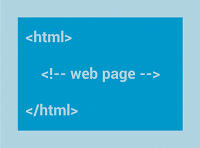

## 布局
布局定义用户界面的视觉结构，如Activity或应用小部件的 UI。您可以通过两种方式声明布局：
 - 在 XML 中声明 UI 元素。Android 提供了对应于 View 类及其子类的简明 XML 词汇，如用于小部件和布局的词汇；
 - 运行时实例化布局元素。您的应用可以通过编程创建 View 对象和 ViewGroup 对象（并操纵其属性）。

Android 框架让您可以灵活地使用以下一种或两种方法来声明和管理应用的 UI。例如，您可以在 XML 中声明应用的默认布局，包括将出现在布局中的屏幕元素及其属性。然后，您可以在应用中添加可在运行时修改屏幕对象（包括那些已在 XML 中声明的对象）状态的代码。

 - 您还应尝试使用层次结构查看器工具来调试布局—当您在模拟器或设备上进行调试时，它会显示布局属性值、绘制具有内边距/外边距指示符的线框以及完整渲染视图。
 - 您可以利用 `layoutopt` 工具快速分析布局和层次结构中是否存在低效环节或其他问题。

在 XML 中声明 UI 的优点在于，您可以更好地将应用的外观与控制应用行为的代码隔离。您的 UI 描述位于应用代码外部，这意味着您在修改或调整描述时无需修改您的源代码并重新编译。例如，您可以创建适用于不同屏幕方向、不同设备屏幕尺寸和不同语言的 XML 布局。此外，在 XML 中声明布局还能更轻松地显示 UI 的结构，从而简化问题调试过程。因此，本文将侧重于示范如何在 XML 中声明布局。如果您对在运行时实例化 View 对象感兴趣，请参阅 `ViewGroup` 类和 `View` 类的参考资料。

一般而言，用于声明 UI 元素的 XML 词汇严格遵循类和方法的结构和命名方式，其中元素名称对应于类名称，属性名称对应于方法。实际上，这种对应关系往往非常直接，让您可以猜到对应于类方法的 XML 属性，或对应于给定 XML 元素的类。但请注意，并非所有词汇都完全相同。在某些情况下，在命名上略有差异。例如，`EditText` 元素具有的 text 属性对应的类方法是 `EditText.setText()`。

>提示：如需了解有关不同布局类型的更多信息，请参阅常见布局对象。

<br>

#### 编写 XML
您可以利用 Android 的 XML 词汇，按照在 HTML 中创建包含一系列嵌套元素的网页的相同方式快速设计 UI 布局及其包含的屏幕元素。

每个布局文件都必须只包含一个根元素，并且该元素必须是视图对象或 `ViewGroup` 对象。定义根元素之后，即可再以子元素的形式添加其他布局对象或小部件，从而逐步构建定义布局的视图层次结构。例如，以下这个 XML 布局使用垂直 `LinearLayout` 来储存一个 `TextView` 和一个 `Button`：
```xml
<?xml version="1.0" encoding="utf-8"?>
<LinearLayout xmlns:android="http://schemas.android.com/apk/res/android"
              android:layout_width="match_parent"
              android:layout_height="match_parent"
              android:orientation="vertical" >
    <TextView android:id="@+id/text"
              android:layout_width="wrap_content"
              android:layout_height="wrap_content"
              android:text="Hello, I am a TextView" />
    <Button android:id="@+id/button"
            android:layout_width="wrap_content"
            android:layout_height="wrap_content"
            android:text="Hello, I am a Button" />
</LinearLayout>
```
在 XML 中声明布局后，请在您的 Android 项目 `res/layout/` 目录中以 `.xml` 扩展名保存文件，以便其能够正确编译。

布局资源文档中提供了有关布局 XML 文件语法的更多信息。

#### 加载 XML 资源
当您编译应用时，每个 XML 布局文件都会编译到一个 `View` 资源中。 您应该在 `Activity.onCreate()` 回调实现中从您的应用代码加载布局资源。请通过调用 `setContentView()`，以 `R.layout.layout_file_name` 形式向其传递对布局资源的引用来执行此操作。例如，如果您的 XML 布局保存为 `main_layout.xml`，则需要像下面这样为您的 Activity 加载该布局：
```java
public void onCreate(Bundle savedInstanceState) {
    super.onCreate(savedInstanceState);
    setContentView(R.layout.main_layout);
}
```
启动您的 Activity 时，Android 框架会调用 Activity 中的 `onCreate()` 回调方法（请参阅Activity文档中有关生命周期的阐述）。

#### 属性
每个视图对象和 ViewGroup 对象都支持各自的各类 XML 属性。某些属性是视图对象的专用属性（例如，TextView 支持 `textSize` 属性），但这些属性也会被任何可以扩展此类的视图对象继承。某些属性通用于所有 View 对象，因为它们继承自根 View 类（如 id 属性）。此外，其他属性被视为“布局参数”，即描述 View 对象特定布局方向的属性，如该对象的父 ViewGroup 对象所定义的属性。

##### ID
任何视图对象都可能具有关联的整型 ID，此 ID 用于在结构树中对 View 对象进行唯一标识。编译应用后，此 ID 将作为整型数引用，但在布局 XML 文件中，通常会在 id 属性中为该 ID 赋予字符串值。这是所有 View 对象共用的 XML 属性（由 View 类定义），您会经常用到它。XML 标记内部的 ID 语法是：
```
android:id="@+id/my_button"
```
字符串开头处的 @ 符号指示 XML 解析程序应该解析并展开 ID 字符串的其余部分，并将其标识为 ID 资源。加号 (+) 表示这是一个新的资源名称，必须创建该名称并将其添加到我们的资源（在 `R.java` 文件中）内。Android 框架还提供了许多其他 ID 资源。 引用 Android 资源 ID 时，不需要加号，但必须添加 android 软件包命名空间，如下所示：
```
android:id="@android:id/empty"
```
添加 android 软件包命名空间之后，现在，我们将从 android.R 资源类而非本地资源类引用 ID。

要想创建视图并从应用中引用它们，常见的模式是：

在布局文件中定义一个视图/小部件，并为其分配一个唯一的 ID：
```xml
<Button android:id="@+id/my_button"
        android:layout_width="wrap_content"
        android:layout_height="wrap_content"
        android:text="@string/my_button_text"/>
```
然后创建一个 view 对象实例，并从布局中捕获它（通常使用 onCreate() 方法）：
```java
Button myButton = (Button) findViewById(R.id.my_button);
```
创建 `RelativeLayout` 时，为 view 对象定义 ID 非常重要。在相对布局中，同级视图可以定义其相对于其他同级视图的布局，同级视图通过唯一的 ID 进行引用。

ID 不需要在整个结构树中具有唯一性，但在您要搜索的结构树部分应具有唯一性（要搜索的部分往往是整个结构树，因此最好尽可能具有全局唯一性）。

##### 布局参数
名为 `layout_something` 的 XML 布局属性可为视图定义与其所在的 ViewGroup 相适的布局参数。

每个 ViewGroup 类都会实现一个扩展 `ViewGroup.LayoutParams` 的嵌套类。此子类包含的属性类型会根据需要为视图组的每个子视图定义尺寸和位置。 正如您在图 1 中所见，父视图组为每个子视图（包括子视图组）定义布局参数。


图 1. 以可视化方式表示的视图层次结构，其中包含与每个视图关联的布局参数。

请注意，每个 LayoutParams 子类都有自己的值设置语法。 每个子元素都必须定义适合其父元素的 LayoutParams，但父元素也可为其子元素定义不同的 LayoutParams。

所有视图组都包括宽度和高度（`layout_width` 和 `layout_height`），并且每个视图都必须定义它们。许多 LayoutParams 还包括可选的外边距和边框。

您可以指定具有确切尺寸的宽度和高度，但您多半不想经常这样做。 在更多的情况下，您会使用以下常量之一来设置宽度或高度：
 - wrap_content 指示您的视图将其大小调整为内容所需的尺寸。
 - match_parent 指示您的视图尽可能采用其父视图组所允许的最大尺寸。

一般而言，建议不要使用绝对单位（如像素）来指定布局宽度和高度， 而是使用相对测量单位，如密度无关像素单位 (dp)、`wrap_content` 或 `match_parent`，这种方法更好，因为它有助于确保您的应用在各类尺寸的设备屏幕上正确显示。可用资源文档中定义了可接受的测量单位类型。

#### 布局位置
视图的几何形状就是矩形的几何形状。视图具有一个位置（以一对水平向左和垂直向上坐标表示）和两个尺寸（以宽度和高度表示）。 位置和尺寸的单位是像素。

可以通过调用方法 `getLeft()` 和方法 `getTop()` 来检索视图的位置。前者会返回表示视图的矩形的水平向左（或称 X 轴） 坐标。后者会返回表示视图的矩形的垂直向上（或称 Y 轴）坐标。 这些方法都会返回视图相对于其父项的位置。 例如，如果 `getLeft()` 返回 20，则意味着视图位于其直接父项左边缘向右 20 个像素处。

此外，系统还提供了几种便捷方法来避免不必要的计算，即 getRight() 和 `getBottom()`。 这些方法会返回表示视图的矩形的右边缘和下边缘的坐标。 例如，调用 `getRight()` 类似于进行以下计算：`getLeft() + getWidth()`。

#### 尺寸、内边距和外边距
视图的尺寸通过宽度和高度表示。视图实际上具有两对宽度和高度值。

第一对称为测量宽度和测量高度。 这些尺寸定义视图想要在其父项内具有的大小。 这些测量尺寸可以通过调用 getMeasuredWidth() 和 getMeasuredHeight() 来获得。

第二对简称为宽度和高度，有时称为绘制宽度和绘制高度。 这些尺寸定义视图在绘制时和布局后在屏幕上的实际尺寸。 这些值可以（但不必）与测量宽度和测量高度不同。 宽度和高度可以通过调用 `getWidth()` 和 `getHeight()` 来获得。

要想测量其尺寸，视图需要将其内边距考虑在内。内边距以视图左侧、顶部、右侧和底部各部分的像素数表示。 内边距可用于以特定数量的像素弥补视图的内容。 例如，左侧内边距为 2，会将视图的内容从左边缘向右推 2 个像素。 可以使用 `setPadding(int, int, int, int)` 方法设置内边距，并通过调用 `getPaddingLeft()`、`getPaddingTop()`、`getPaddingRight()` 和 `getPaddingBottom()` 进行查询。

尽管视图可以定义内边距，但它并不支持外边距。 不过，视图组可以提供此类支持。如需了解更多信息，请参阅 `ViewGroup` 和 `ViewGroup.MarginLayoutParams`。

如需了解有关尺寸的详细信息，请参阅尺寸值。

#### 常见布局
`ViewGroup` 类的每个子类都提供了一种独特的方式来显示您在其中嵌套的视图。以下是 Android 平台中内置的一些较为常见的布局类型。

>注：尽管您可以通过将一个或多个布局嵌套在另一个布局内来实现您的 UI 设计，但应该使您的布局层次结构尽可能简略。布局的嵌套布局越少，绘制速度越快（扁平的视图层次结构优于深层的视图层次结构）。

###### 线性布局

一种使用单个水平行或垂直行来组织子项的布局。它会在窗口长度超出屏幕长度时创建一个滚动条。

###### 相对布局

让您能够指定子对象彼此之间的相对位置（子对象 A 在子对象 B 左侧）或子对象与父对象的相对位置（与父对象顶部对齐）。

###### 网页视图

显示网页。

#### 使用适配器构建布局
如果布局的内容是属于动态或未预先确定的内容，您可以使用这样一种布局：在运行时通过子类 `AdapterView` 用视图填充布局。 `AdapterView` 类的子类使用 `Adapter` 将数据与其布局绑定。`Adapter` 充当数据源与 `AdapterView` 布局之间的中间人—`Adapter`（从数组或数据库查询等来源）检索数据，并将每个条目转换为可以添加到 `AdapterView` 布局中的视图。

适配器支持的常见布局包括：

###### 列表视图

显示滚动的单列列表。

###### 网格视图

显示滚动的行列网格。

##### 使用数据填充适配器视图
您可以通过将 `AdapterView` 实例与 `Adapter` 绑定来填充 `AdapterView`（如 `ListView` 或 `GridView`），此操作会从外部来源检索数据，并创建表示每个数据条目的 `View`。

Android 提供了几个 `Adapter` 子类，用于检索不同种类的数据和构建 `AdapterView` 的视图。 两种最常见的适配器是：

- `ArrayAdapter`
请在数据源为数组时使用此适配器。默认情况下，`ArrayAdapter` 会通过在每个项目上调用 `toString()` 并将内容放入 `TextView` 来为每个数组项创建视图。
例如，如果您具有想要在 `ListView` 中显示的字符串数组，请使用构造函数初始化一个新的 `ArrayAdapter`，为每个字符串和字符串数组指定布局：
```java
ArrayAdapter<String> adapter = new ArrayAdapter<String>(this,
        android.R.layout.simple_list_item_1, myStringArray);
```
此构造函数的参数是：
 - 您的应用 `Context`
 - 包含数组中每个字符串的 `TextView` 的布局
 - 字符串数组
然后，只需在您的 `ListView` 上调用 `setAdapter()`：
```java
ListView listView = (ListView) findViewById(R.id.listview);
listView.setAdapter(adapter);
```

 要想自定义每个项的外观，您可以重写数组中各个对象的 `toString()` 方法。或者，要想为 `TextView` 之外的每个项创建视图（例如，如果您想为每个数组项创建一个 `ImageView`），请扩展 `ArrayAdapter` 类并重写 `getView()` 以返回您想要为每个项获取的视图类型。

- `SimpleCursorAdapter`
请在数据来自 `Cursor` 时使用此适配器。使用 `SimpleCursorAdapter` 时，您必须指定要为 `Cursor` 中的每个行使用的布局，以及应该在哪些布局视图中插入 `Cursor` 中的哪些列。 例如，如果您想创建人员姓名和电话号码列表，则可以执行一个返回 `Cursor`（包含对应每个人的行，以及对应姓名和号码的列）的查询。 然后，您可以创建一个字符串数组，指定您想要在每个结果的布局中包含 `Cursor` 中的哪些列，并创建一个整型数组，指定应该将每个列放入的对应视图：
```java
String[] fromColumns = {ContactsContract.Data.DISPLAY_NAME,
                        ContactsContract.CommonDataKinds.Phone.NUMBER};
int[] toViews = {R.id.display_name, R.id.phone_number};
```
当您实例化 `SimpleCursorAdapter` 时，请传递要用于每个结果的布局、包含结果的 `Cursor` 以及以下两个数组：
```java
SimpleCursorAdapter adapter = new SimpleCursorAdapter(this,
        R.layout.person_name_and_number, cursor, fromColumns, toViews, 0);
ListView listView = getListView();
listView.setAdapter(adapter);
```
然后，`SimpleCursorAdapter` 会使用提供的布局，将每个 `fromColumns` 项插入对应的 `toViews` 视图，为 `Cursor` 中的每个行创建一个视图。

如果您在应用的生命周期中更改了适配器读取的底层数据，则应调用 `notifyDataSetChanged()`。此操作会通知附加的视图，数据发生了变化，它应该自行刷新。

#### 处理点击事件
您可以通过实现 `AdapterView.OnItemClickListener` 界面来响应 `AdapterView` 中每一项上的点击事件。 例如：
```java
// Create a message handling object as an anonymous class.
private OnItemClickListener mMessageClickedHandler = new OnItemClickListener() {
    public void onItemClick(AdapterView parent, View v, int position, long id) {
        // Do something in response to the click
    }
};

listView.setOnItemClickListener(mMessageClickedHandler);
```