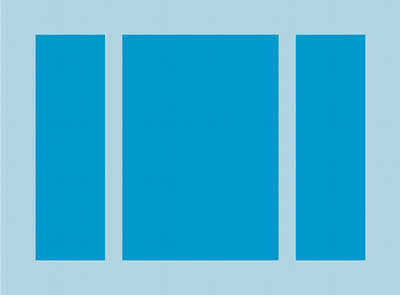
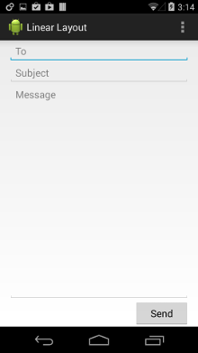

## 线性布局
`LinearLayout` 是一个视图组，用于使所有子视图在单个方向（垂直或水平）保持对齐。 您可以使用 `android:orientation` 属性指定布局方向。


`LinearLayout` 的所有子视图依次堆叠，因此无论子视图有多宽，垂直列表每行均只有一个子视图，水平列表将只有一行高（最高子视图的高度加上内边距）。 `LinearLayout` 遵守子视图之间的“边距”以及每个子视图的“重力”（右对齐、居中对齐、左对齐）。

### 布局权重
####权重相等的子视图
要创建一个线性布局，让每个子视图在屏幕上都占据相同的空间量，则将每个视图的 `android:layout_height` 均设置为 "0dp"（对于垂直布局），或将每个视图的`android:layout_width` 均设置为 "0dp"（对于水平布局）。 然后，将每个视图的 `android:layout_weight` 均设置为 "1"。

`LinearLayout` 还支持使用 `android:layout_weight` 属性为各个子视图分配权重。此属性根据视图应在屏幕上占据的空间量向视图分配“重要性”值。 权重值更大的视图可以填充父视图中任何剩余的空间。子视图可以指定权重值，然后系统会按照子视图声明的权重值的比例，将视图组中的任何剩余空间分配给子视图。 默认权重为零。

例如，如果有三个文本字段，其中两个声明权重为 1，另一个没有赋予权重，则没有权重的第三个文本字段将不会扩展，并且仅占据其内容所需的区域。 另外两个文本字段将以同等幅度进行扩展，以填充所有三个字段都测量后还剩余的空间。 如果为第三个字段提供权重 2（而非 0），那么相当于声明现在它比其他两个字段更为重要，因此，它将获得总剩余空间的一半，其他两个均享余下空间。

示例
```xml
<?xml version="1.0" encoding="utf-8"?>
<LinearLayout xmlns:android="http://schemas.android.com/apk/res/android"
    android:layout_width="match_parent"
    android:layout_height="match_parent"
    android:paddingLeft="16dp"
    android:paddingRight="16dp"
    android:orientation="vertical" >
    <EditText
        android:layout_width="match_parent"
        android:layout_height="wrap_content"
        android:hint="@string/to" />
    <EditText
        android:layout_width="match_parent"
        android:layout_height="wrap_content"
        android:hint="@string/subject" />
    <EditText
        android:layout_width="match_parent"
        android:layout_height="0dp"
        android:layout_weight="1"
        android:gravity="top"
        android:hint="@string/message" />
    <Button
        android:layout_width="100dp"
        android:layout_height="wrap_content"
        android:layout_gravity="right"
        android:text="@string/send" />
</LinearLayout>
```

有关 `LinearLayout` 的每个子视图可用属性的详情，请参阅 [LinearLayout.LayoutParams](https://developer.android.com/reference/android/widget/LinearLayout.LayoutParams.html)。