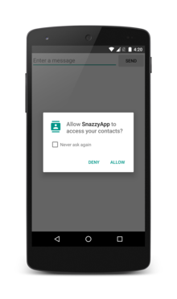

## 在运行时请求权限
从 Android 6.0（API 级别 23）开始，用户开始在应用运行时向其授予权限，而不是在应用安装时授予。此方法可以简化应用安装过程，因为用户在安装或更新应用时不需要授予权限。它还让用户可以对应用的功能进行更多控制；例如，用户可以选择为相机应用提供相机访问权限，而不提供设备位置的访问权限。用户可以随时进入应用的“Settings”页面设置权限。

系统权限分为两类：*正常权限* 和*危险权限*：

- 正常权限不会直接给用户隐私权带来风险。如果您的应用在其清单中列出了正常权限，系统将自动授予该权限。
- 危险权限会授予应用访问用户机密数据的权限。如果您列出了危险权限，则用户必须明确批准您的应用使用这些权限。

如需了解详细信息，请参阅正常权限和危险权限。

在所有版本的 Android 中，您的应用都需要在其应用清单中同时声明它需要的正常权限和危险权限，如声明权限中所述。不过，该声明的影响因系统版本和应用的目标 SDK 级别的不同而有所差异：

- 如果设备运行的是 Android 5.1 或更低版本，或者应用的目标 SDK 为 22 或更低：如果您在清单中列出了危险权限，则用户必须在安装应用时授予此权限；如果他们不授予此权限，系统根本不会安装应用。
- 如果设备运行的是 Android 6.0 或更高版本，或者应用的目标 SDK 为 23 或更高：应用必须在清单中列出权限，并且它必须在运行时请求其需要的每项危险权限。用户可以授予或拒绝每项权限，且即使用户拒绝权限请求，应用仍可以继续运行有限的功能。

>注：从 Android 6.0（API 级别 23）开始，用户可以随时从任意应用调用权限，即使应用面向较低的 API 级别也可以调用。无论您的应用面向哪个 API 级别，您都应对应用进行测试，以验证它在缺少需要的权限时行为是否正常。

本课将介绍如何使用 Android 支持库来检查和请求权限。Android 框架从 Android 6.0（API 级别 23）开始提供类似方法。不过，使用支持库更简单，因为在调用方法前，您的应用不需要检查它在哪个版本的 Android 上运行。

<br>

#### 检查权限
如果您的应用需要危险权限，则每次执行需要这一权限的操作时您都必须检查自己是否具有该权限。用户始终可以自由调用此权限，因此，即使应用昨天使用了相机，它不能假设自己今天仍具有该权限。

要检查您是否具有某项权限，请调用 `ContextCompat.checkSelfPermission()` 方法。例如，以下代码段显示了如何检查 Activity 是否具有在日历中进行写入的权限：
```java
// Assume thisActivity is the current activity
int permissionCheck = ContextCompat.checkSelfPermission(thisActivity,
        Manifest.permission.WRITE_CALENDAR);
```
如果应用具有此权限，方法将返回 `PackageManager.PERMISSION_GRANTED`，并且应用可以继续操作。如果应用不具有此权限，方法将返回 `PERMISSION_DENIED`，且应用必须明确向用户要求权限。

<br>

#### 请求权限
如果您的应用需要应用清单中列出的危险权限，那么，它必须要求用户授予该权限。Android 为您提供了多种权限请求方式。调用这些方法将显示一个标准的 Android 对话框，不过，您不能对它们进行自定义。


图 1. 提示用户授予或拒绝权限的系统对话框。


##### 解释应用为什么需要权限
在某些情况下，您可能需要帮助用户了解您的应用为什么需要某项权限。例如，如果用户启动一个摄影应用，用户对应用要求使用相机的权限可能不会感到吃惊，但用户可能无法理解为什么此应用想要访问用户的位置或联系人。在请求权限之前，不妨为用户提供一个解释。请记住，您不需要通过解释来说服用户；如果您提供太多解释，用户可能发现应用令人失望并将其移除。

您可以采用的一个方法是仅在用户已拒绝某项权限请求时提供解释。如果用户继续尝试使用需要某项权限的功能，但继续拒绝权限请求，则可能表明用户不理解应用为什么需要此权限才能提供相关功能。对于这种情况，比较好的做法是显示解释。

为了帮助查找用户可能需要解释的情形，Android 提供了一个实用程序方法，即 `shouldShowRequestPermissionRationale()`。如果应用之前请求过此权限但用户拒绝了请求，此方法将返回 true。

>注：如果用户在过去拒绝了权限请求，并在权限请求系统对话框中选择了 Don't ask again 选项，此方法将返回 false。如果设备规范禁止应用具有该权限，此方法也会返回 false。

<br>

##### 请求您需要的权限
如果应用尚无所需的权限，则应用必须调用一个 `requestPermissions()` 方法，以请求适当的权限。应用将传递其所需的权限，以及您指定用于识别此权限请求的整型请求代码。此方法异步运行：它会立即返回，并且在用户响应对话框之后，系统会使用结果调用应用的回调方法，将应用传递的相同请求代码传递到 `requestPermissions()`。

以下代码可以检查应用是否具备读取用户联系人的权限，并根据需要请求该权限：
```java
// Here, thisActivity is the current activity
if (ContextCompat.checkSelfPermission(thisActivity,
                Manifest.permission.READ_CONTACTS)
        != PackageManager.PERMISSION_GRANTED) {

    // Should we show an explanation?
    if (ActivityCompat.shouldShowRequestPermissionRationale(thisActivity,
            Manifest.permission.READ_CONTACTS)) {

        // Show an expanation to the user *asynchronously* -- don't block
        // this thread waiting for the user's response! After the user
        // sees the explanation, try again to request the permission.

    } else {

        // No explanation needed, we can request the permission.

        ActivityCompat.requestPermissions(thisActivity,
                new String[]{Manifest.permission.READ_CONTACTS},
                MY_PERMISSIONS_REQUEST_READ_CONTACTS);

        // MY_PERMISSIONS_REQUEST_READ_CONTACTS is an
        // app-defined int constant. The callback method gets the
        // result of the request.
    }
}
```
>注：当您的应用调用 `requestPermissions()` 时，系统将向用户显示一个标准对话框。您的应用无法配置或更改此对话框。如果您需要为用户提供任何信息或解释，您应在调用 `requestPermissions()` 之前进行，如解释应用为什么需要权限中所述。

<br>

##### 处理权限请求响应
当应用请求权限时，系统将向用户显示一个对话框。当用户响应时，系统将调用应用的 `onRequestPermissionsResult()` 方法，向其传递用户响应。您的应用必须替换该方法，以了解是否已获得相应权限。回调会将您传递的相同请求代码传递给 `requestPermissions()`。例如，如果应用请求 `READ_CONTACTS` 访问权限，则它可能采用以下回调方法：
```java
@Override
public void onRequestPermissionsResult(int requestCode,
        String permissions[], int[] grantResults) {
    switch (requestCode) {
        case MY_PERMISSIONS_REQUEST_READ_CONTACTS: {
            // If request is cancelled, the result arrays are empty.
            if (grantResults.length > 0
                && grantResults[0] == PackageManager.PERMISSION_GRANTED) {

                // permission was granted, yay! Do the
                // contacts-related task you need to do.

            } else {

                // permission denied, boo! Disable the
                // functionality that depends on this permission.
            }
            return;
        }

        // other 'case' lines to check for other
        // permissions this app might request
    }
}
```
系统显示的对话框说明了您的应用需要访问的权限组；它不会列出具体权限。例如，如果您请求 `READ_CONTACTS` 权限，系统对话框只显示您的应用需要访问设备的联系人。用户只需要为每个权限组授予一次权限。如果您的应用请求该组中的任何其他权限（已在您的应用清单中列出），系统将自动授予应用这些权限。当您请求此权限时，系统会调用您的 `onRequestPermissionsResult()` 回调方法，并传递 `PERMISSION_GRANTED`，如果用户已通过系统对话框明确同意您的权限请求，系统将采用相同方式操作。

>注：您的应用仍需要明确请求其需要的每项权限，即使用户已向应用授予该权限组中的其他权限。此外，权限分组在将来的 Android 版本中可能会发生变化。您的代码不应依赖特定权限属于或不属于相同组这种假设。

例如，假设您在应用清单中列出了 `READ_CONTACTS` 和 `WRITE_CONTACTS`。如果您请求 `READ_CONTACTS` 且用户授予了此权限，那么，当您请求 `WRITE_CONTACTS` 时，系统将立即授予您该权限，不会与用户交互。

如果用户拒绝了某项权限请求，您的应用应采取适当的操作。例如，您的应用可能显示一个对话框，解释它为什么无法执行用户已经请求但需要该权限的操作。

当系统要求用户授予权限时，用户可以选择指示系统不再要求提供该权限。这种情况下，无论应用在什么时候使用 `requestPermissions()` 再次要求该权限，系统都会立即拒绝此请求。系统会调用您的 `onRequestPermissionsResult()` 回调方法，并传递 `PERMISSION_DENIED`，如果用户再次明确拒绝了您的请求，系统将采用相同方式操作。这意味着当您调用 `requestPermissions()` 时，您不能假设已经发生与用户的任何直接交互。