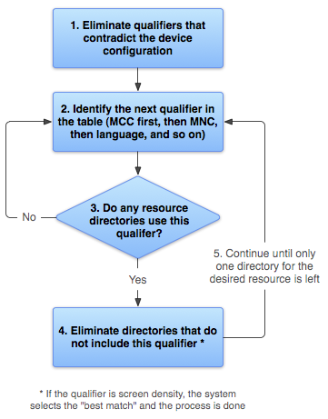

## 提供资源
您应该始终外部化应用资源，例如图像和代码中的字符串，这样有利于您单独维护这些资源。 此外，您还应该为特定设备配置提供备用资源，方法是将它们分组到专门命名的资源目录中。 在运行时，Android 会根据当前配置使用适当的资源。例如，您可能需要根据屏幕尺寸提供不同的 UI 布局，或者根据语言设置提供不同的字符串。

外部化应用资源后，即可使用在项目 R 类中生成的资源 ID 访问这些资源。有关如何在应用中使用资源，我们将在访问资源中讨论。 本文档介绍如何对 Android 项目中的资源进行分组，以及如何为特定的设备配置提供备用资源。

##### 分组资源类型
您应将各种资源放入项目 `res/` 目录的特定子目录下。例如，以下是一个简单项目的文件层次结构：
```
MyProject/
    src/  
        MyActivity.java  
    res/
        drawable/  
            graphic.png  
        layout/  
            main.xml
            info.xml
        mipmap/  
            icon.png 
        values/  
            strings.xml  
```
正如您在此示例中所看到的那样，`res/` 目录包含所有资源（在子目录下）：一个图像资源、两个布局资源、启动器图标的 `mipmap/` 目录以及一个字符串资源文件。资源目录名称非常重要，将在表 1 中进行介绍。

>注：如需了解有关使用 mipmap 文件夹的详细信息，请参阅管理项目概览。

表 1. 项目 `res/` 目录内支持的资源目录。

|目录|	资源类型|
|--------|--------|
|animator/|	用于定义属性动画的 XML 文件。|
|anim/|	定义渐变动画的 XML 文件。（属性动画也可以保存在此目录中，但是为了区分这两种类型，属性动画首选 `animator/` 目录。）|
|color/|	用于定义颜色状态列表的 XML 文件。请参阅颜色状态列表资源|
|drawable/|	位图文件（.png、.9.png、.jpg、.gif）或编译为以下可绘制对象资源子类型的 XML 文件：<br>- 位图文件<br>- 九宫格（可调整大小的位图）<br>- 状态列表<br>- Shape<br>- 动画可绘制对象<br>- 其他可绘制对象<br>请参阅 可绘制对象资源。|
|mipmap/|	适用于不同启动器图标密度的可绘制对象文件。如需了解有关使用 `mipmap/` 文件夹管理启动器图标的详细信息，请参阅管理项目概览。
|layout/|	用于定义用户界面布局的 XML 文件。 请参阅布局资源。
|menu/|	用于定义应用菜单（如选项菜单、上下文菜单或子菜单）的 XML 文件。请参阅菜单资源。
|raw/	|要以原始形式保存的任意文件。要使用原始 `InputStream` 打开这些资源，请使用资源 ID（即 `R.raw.filename`）调用 `Resources.openRawResource()`。<br><br>但是，如需访问原始文件名和文件层次结构，则可以考虑将某些资源保存在 assets/ 目录下（而不是 `res/raw/`）。`assets/` 中的文件没有资源 ID，因此您只能使用 `AssetManager` 读取这些文件。
|values/|包含字符串、整型数和颜色等简单值的 XML 文件。<br><br>其他 `res/` 子目录中的 XML 资源文件是根据 XML 文件名定义单个资源，而 `values/` 目录中的文件可描述多个资源。对于此目录中的文件，`<resources>` 元素的每个子元素均定义一个资源。例如，`<string>` 元素创建 R.string 资源，`<color>` 元素创建 R.color 资源。<br><br>由于每个资源均用其自己的 XML 元素定义，因此您可以根据自己的需要命名文件，并将不同的资源类型放在一个文件中。但是，为了清晰起见，您可能需要将独特的资源类型放在不同的文件中。 例如，对于可在此目录中创建的资源，下面给出了相应的文件名约定：<br>- arrays.xml，用于资源数组（类型化数组）。<br>- colors.xml：颜色值。<br>- dimens.xml：尺寸值。<br>- strings.xml：字符串值。<br>- styles.xml：样式。<br>请参阅字符串资源、样式资源和更多资源类型。|
|xml/|	可以在运行时通过调用 `Resources.getXML()` 读取的任意 XML 文件。各种 XML 配置文件（如可搜索配置）都必须保存在此处。|
>**注意：切勿将资源文件直接保存在 `res/` 目录内，这会导致出现编译错误。**

如需了解有关某些资源类型的详细信息，请参阅资源类型文档。

保存在表 1 中定义的子目录下的资源是“默认”资源。即，这些资源定义应用的默认设计和内容。但是，采用 Android 技术的不同设备类型可能需要不同类型的资源。例如，如果设备的屏幕尺寸大于标准屏幕，则应提供不同的布局资源，以充分利用额外的屏幕空间。 或者，如果设备的语言设置不同，则应提供不同的字符串资源，以转换用户界面中的文本。 要为不同的设备配置提供这些不同资源，除了默认资源以外，您还需要提供备用资源。

<br>

##### 提供备用资源

图 1. 两种不同的设备，均使用不同的布局资源。

几乎每个应用都应提供备用资源以支持特定的设备配置。 例如，对于不同的屏幕密度和语言，您应分别包括备用可绘制对象资源和备用字符串资源。 在运行时，Android 会检测当前设备配置并为应用加载合适的资源。

为一组资源指定特定于配置的备用资源：
- 在 `res/` 中创建一个以 `<resources_name>`-`<config_qualifier>`形式命名的新目录。
 - `<resources_name>`是相应默认资源的目录名称（如表 1 中所定义）。
 - `<qualifier>`是指定要使用这些资源的各个配置的名称（如表 2 中所定义）。

 您可以追加多个 `<qualifier>`。以短划线将其分隔。

>注意：追加多个限定符时，必须按照表 2 中列出的相同顺序放置它们。如果限定符的顺序错误，则该资源将被忽略。

- 将相应的备用资源保存在此新目录下。这些资源文件的名称必须与默认资源文件完全一样。

例如，以下是一些默认资源和备用资源：
```
res/
    drawable/   
        icon.png
        background.png    
    drawable-hdpi/  
        icon.png
        background.png  
```
`hdpi` 限定符表示该目录中的资源适用于屏幕密度较高的设备。其中每个可绘制对象目录中的图像已针对特定的屏幕密度调整大小，但是文件名完全相同。 这样一来，用于引用 `icon.png` 或 `background.png` 图像的资源 ID 始终相同，但是 Android 会通过将设备配置信息与资源目录名称中的限定符进行比较，选择最符合当前设备的各个资源版本。

Android 支持若干配置限定符，您可以通过使用短划线分隔每个限定符，向一个目录名称添加多个限定符。表 2 按优先顺序列出了有效的配置限定符；如果对资源目录使用多个限定符，则必须按照表中列出的顺序将它们添加到目录名称。

表 2. 配置限定符名称。

|配置|	限定符值|	说明|
|--------|--------|-----|
|MCC 和 MNC|	示例：<br>mcc310<br>mcc310-mnc004<br>mcc208-mnc00<br>等等|移动国家代码 (MCC)，（可选）后跟设备 SIM 卡中的移动网络代码 (MNC)。例如，mcc310 是指美国的任一运营商，mcc310-mnc004 是指美国的 Verizon 公司，mcc208-mnc00 是指法国的 Orange 公司。<br><br>如果设备使用无线电连接（GSM 手机），则 MCC 和 MNC 值来自 SIM 卡。<br><br>也可以单独使用 MCC（例如，将国家/地区特定的合法资源包括在应用中）。如果只需根据语言指定，则改用“语言和区域”限定符（稍后进行介绍）。 如果决定使用 MCC 和 MNC 限定符，请谨慎执行此操作并测试限定符是否按预期工作。<br><br>另请参阅配置字段 mcc 和 mnc，这两个字段分别表示当前的移动国家代码和移动网络代码。
|语言和区域|示例：<br>en<br>fr<br>en-rUS<br>fr-rFR<br>fr-rCA<br>等等|语言通过由两个字母组成的 `ISO 639-1` 语言代码定义，可以选择后跟两个字母组成的 `ISO 3166-1-alpha-2` 区域码（前带小写字母“r”）。<br><br>这些代码不区分大小写；r 前缀用于区分区域码。 不能单独指定区域。<br><br>如果用户更改系统设置中的语言，它有可能在应用生命周期中发生改变。 如需了解这会在运行期间给应用带来哪些影响，请参阅处理运行时变更。<br><br>有关针对其他语言本地化应用的完整指南，请参阅本地化。<br><br>另请参阅 `locale` 配置字段，该字段表示当前的语言区域。
|布局方向|	ldrtl<br>ldltr|应用的布局方向。ldrtl 是指“布局方向从右到左”。ldltr 是指“布局方向从左到右”，这是默认的隐式值。<br><br>它适用于布局、图片或值等任何资源。<br><br>例如，若要针对阿拉伯语提供某种特定布局，并针对任何其他“从右到左”语言（如波斯语或希伯来语）提供某种通用布局，则可编码如下：<br>res/   layout/   <br>        main.xml  (Default layout)<br>    layout-ar/  <br>        main.xml  (Specific layout for Arabic)<br>    layout-ldrtl/  <br>        main.xml  (Any "right-to-left" language, except<br>                  for Arabic, because the "ar" language qualifier<br>                  has a higher precedence.)<br>**注：要为应用启用从右到左的布局功能，必须将 supportsRtl 设置为 "true"，并将 targetSdkVersion 设置为 17 或更高版本。**<br>此项为 API 级别 17 中新增配置。
|smallestWidth|	`sw<N>dp`<br>示例：<br>sw320dp<br>sw600dp<br>sw720dp<br>等等|屏幕的基本尺寸，由可用屏幕区域的最小尺寸指定。 具体来说，设备的 smallestWidth 是屏幕可用高度和宽度的最小尺寸（您也可以将其视为屏幕的“最小可能宽度”）。无论屏幕的当前方向如何，您均可使用此限定符确保应用 UI 的可用宽度至少为 `<N>dp`。<br><br>例如，如果布局要求屏幕区域的最小尺寸始终至少为 600dp，则可使用此限定符创建布局资源 `res/layout-sw600dp/`。仅当可用屏幕的最小尺寸至少为 600dp 时，系统才会使用这些资源，而不考虑 600dp 所代表的边是用户所认为的高度还是宽度。smallestWidth 是设备的固定屏幕尺寸特性；设备的 smallestWidth 不会随屏幕方向的变化而改变。<br><br>设备的 smallestWidth 将屏幕装饰元素和系统 UI 考虑在内。例如，如果设备的屏幕上有一些永久性 UI 元素占据沿 smallestWidth 轴的空间，则系统会声明 smallestWidth 小于实际屏幕尺寸，因为这些屏幕像素不适用于您的 UI。 因此，使用的值应该是布局所需要的实际最小尺寸（通常，无论屏幕的当前方向如何，此值都是布局支持的“最小宽度”）。<br>以下是一些可用于普通屏幕尺寸的值：<br>- 320，适用于屏幕配置如下的设备：<br>-- 240x320 ldpi（QVGA 手机）<br>-- 320x480 mdpi（手机）<br>-- 480x800 hdpi（高密度手机）<br>- 480，适用于 480x800 mdpi 之类的屏幕（平板电脑/手机）。<br>- 600，适用于 600x1024 mdpi 之类的屏幕（7 英寸平板电脑）。<br>- 720，适用于 720x1280 mdpi 之类的屏幕（10 英寸平板电脑）。<br><br>应用为多个资源目录提供不同的 smallestWidth 限定符值时，系统会使用最接近（但未超出）设备 smallestWidth 的值。<br><br>此项为 API 级别 13 中新增配置。<br><br>另请参阅 android:requiresSmallestWidthDp 属性和 smallestScreenWidthDp 配置字段，前者声明与应用兼容的最小 smallestWidth；后者存放设备的 smallestWidth 值。<br><br>如需了解有关设计不同屏幕和使用此限定符的详细信息，请参阅支持多种屏幕开发者指南。
|可用宽度|	`w<N>dp`<br>示例：<br>w720dp<br>w1024dp<br>等等|指定资源应该使用的最小可用屏幕宽度，以 dp 为单位，由 `<N>` 值定义。在横向和纵向之间切换时，为了匹配当前实际宽度，此配置值也会随之发生变化。<br><br>应用为多个资源目录提供不同的此配置值时，系统会使用最接近（但未超出）设备当前屏幕宽度的值。 此处的值考虑到了屏幕装饰元素，因此如果设备显示屏的左边缘或右边缘上有一些永久性 UI 元素，考虑到这些 UI 元素，它会使用小于实际屏幕尺寸的宽度值，这样会减少应用的可用空间。<br><br>此项为 API 级别 13 中新增配置。<br>另请参阅 `screenWidthDp` 配置字段，该字段存放当前屏幕宽度。<br><br>如需了解有关设计不同屏幕和使用此限定符的详细信息，请参阅支持多种屏幕开发者指南。
|可用高度|	`h<N>dp`<br>示例：<br>h720dp<br>h1024dp<br>等等	|指定资源应该使用的最小可用屏幕高度，以“dp”为单位，由 `<N>` 值定义。 在横向和纵向之间切换时，为了匹配当前实际高度，此配置值也会随之发生变化。<br><br>应用为多个资源目录提供不同的此配置值时，系统会使用最接近（但未超出）设备当前屏幕高度的值。 此处的值考虑到了屏幕装饰元素，因此如果设备显示屏的上边缘或下边缘有一些永久性 UI 元素，考虑到这些 UI 元素，同时为减少应用的可用空间，它会使用小于实际屏幕尺寸的高度值。 非固定的屏幕装饰元素（例如，全屏时可隐藏的手机状态栏）并不在考虑范围内，标题栏或操作栏等窗口装饰也不在考虑范围内，因此应用必须准备好处理稍小于其所指定值的空间。<br><br>此项为 API 级别 13 中新增配置。<br><br>另请参阅 `screenHeightDp` 配置字段，该字段存放当前屏幕宽度。<br><br>如需了解有关设计不同屏幕和使用此限定符的详细信息，请参阅支持多种屏幕开发者指南。
|屏幕尺寸|	small<br>normal<br>large<br>xlarge	|- **small**：尺寸类似于低密度 QVGA 屏幕的屏幕。小屏幕的最小布局尺寸约为 320x426 dp 单位。例如，QVGA 低密度屏幕和 VGA 高密度屏幕。<br>- **normal**：尺寸类似于中等密度 HVGA 屏幕的屏幕。标准屏幕的最小布局尺寸约为 320x470 dp 单位。例如<br>WQVGA 低密度屏幕、HVGA 中等密度屏幕、WVGA 高密度屏幕。<br>- **large**：尺寸类似于中等密度 VGA 屏幕的屏幕。 大屏幕的最小布局尺寸约为 480x640 dp 单位。 例如，VGA 和 WVGA 中等密度屏幕。<br>- **xlarge**：明显大于传统中等密度 HVGA 屏幕的屏幕。超大屏幕的最小布局尺寸约为 720x960 dp 单位。在大多数情况下，屏幕超大的设备体积过大，不能放进口袋，最常见的是平板式设备。 API 级别 9 中的新增配置。<br><br>注：使用尺寸限定符并不表示资源仅适用于该尺寸的屏幕。 如果没有为备用资源提供最符合当前设备配置的限定符，则系统可能使用其中最匹配的资源。<br><br>**注意：如果所有资源均使用大于当前屏幕的尺寸限定符，则系统不会使用这些资源，并且应用在运行时将会崩溃（例如，如果所有布局资源均用 xlarge 限定符标记，但设备是标准尺寸的屏幕）。**<br><br>此项为 API 级别 4 中新增配置。<br><br>如需了解详细信息，请参阅支持多种屏幕。<br><br>另请参阅 `screenLayout` 配置字段，该字段表示屏幕是小尺寸、标准尺寸还是大尺寸。
|屏幕纵横比|	long<br>notlong	|**long**：宽屏，如 WQVGA、WVGA、FWVGA<br>**notlong**：非宽屏，如 QVGA、HVGA 和 VGA<br>此项为 API 级别 4 中新增配置。<br><br>它完全基于屏幕的纵横比（宽屏较宽），而与屏幕方向无关。<br><br>另请参阅 `screenLayout` 配置字段，该字段指示屏幕是否为宽屏。
|圆形屏幕|	round<br>notround|	**round**：圆形屏幕，例如圆形可穿戴式设备<br>**notround**：方形屏幕，例如手机或平板电脑<br>此项为 API 级别 23 中新增配置。<br><br>另请参阅 `isScreenRound()` 配置方法，其指示屏幕是否为宽屏。
|屏幕方向|	port<br>land|	**port**：设备处于纵向（垂直）<br>**land**：设备处于横向（水平）<br>如果用户旋转屏幕，它有可能在应用生命周期中发生改变。 如需了解这会在运行期间给应用带来哪些影响，请参阅处理运行时变更。<br><br>另请参阅 `orientation` 配置字段，该字段指示当前的设备方向。
|UI 模式|	car<br>desk<br>television<br>appliance <br>watch|car：设备正在车载手机座上显示<br>**desk**：设备正在桌面手机座上显示<br>**television**：设备正在电视上显示，为用户提供“十英尺”体验，其 UI 位于远离用户的大屏幕上，主要面向方向键或其他非指针式交互<br>**appliance**：设备用作不带显示屏的装置<br>**watch**：设备配有显示屏，戴在手腕上<br>此项为 API 级别 8 中新增配置，API 13 中新增电视配置，API 20 中新增手表配置。<br><br>如需了解应用在设备插入手机座或从中移除时的响应方式，请阅读确定并监控插接状态和类型。<br><br>如果用户将设备放入手机座中，它有可能在应用生命周期中发生改变。 可以使用 UiModeManager 启用或禁用其中某些模式。如需了解这会在运行期间给应用带来哪些影响，请参阅处理运行时变更。
|夜间模式|	night<br>notnight	|**night**：夜间<br>**notnight**：白天<br>此项为 API 级别 8 中新增配置。<br><br>如果夜间模式停留在自动模式（默认），它有可能在应用生命周期中发生改变。在这种情况下，该模式会根据当天的时间进行调整。 可以使用 `UiModeManager` 启用或禁用此模式。如需了解这会在运行期间给应用带来哪些影响，请参阅处理运行时变更。
|屏幕像素密度 (dpi)|	ldpi<br>mdpi<br>hdpi<br>xhdpi<br>xxhdpi<br>xxxhdpi<br>nodpi<br>tvdpi<br>anydpi|**ldpi**：低密度屏幕；约为 120dpi。<br>**mdpi**：中等密度（传统 HVGA）屏幕；约为 160dpi。<br>**hdpi**：高密度屏幕；约为 240dpi。<br>**xhdpi**：超高密度屏幕；约为 320dpi。此项为 API 级别 8 中新增配置<br>**xxhdpi**：超超高密度屏幕；约为 480dpi。此项为 API 级别 16 中新增配置<br>**xxxhdpi**：超超超高密度屏幕使用（仅限启动器图标，请参阅“支持多种屏幕”中的注释）；约为 640dpi。 此项为 API 级别 18 中新增配置<br>**nodpi**：它可用于您不希望缩放以匹配设备密度的位图资源。<br>**tvdpi**：密度介于 mdpi 和 hdpi 之间的屏幕；约为 213dpi。它并不是“主要”密度组， 主要用于电视，而大多数应用都不需要它。对于大多数应用而言，提供 mdpi 和 hdpi 资源便已足够，系统将根据需要对其进行缩放。此项为 API 级别 13 中新增配置<br>**anydpi**：此限定符适合所有屏幕密度，其优先级高于其他限定符。 这对于矢量可绘制对象很有用。 此项为 API 级别 21 中新增配置<br><br>六个主要密度之间的缩放比为 3:4:6:8:12:16（忽略 tvdpi 密度）。因此，9x9 (ldpi) 位图相当于 12x12 (mdpi)、18x18 (hdpi)、24x24 (xhdpi) 位图，依此类推。<br><br>如果您认为图像资源在电视或其他某些设备上呈现的效果不够好，而想尝试使用 tvdpi 资源，则缩放比例为 1.33*mdpi。例如，mdpi 屏幕的 100px x 100px 图像应该相当于 tvdpi 的133px x 133px。<br><br>注：使用密度限定符并不表示资源仅适用于该密度的屏幕。 如果没有为备用资源提供最符合当前设备配置的限定符，则系统可能使用其中最匹配的资源。<br><br>如需了解有关如何处理不同屏幕密度以及 Android 如何缩放位图以适应当前密度的详细信息，请参阅支持多种屏幕。
|触摸屏类型|	notouch<br>finger|**notouch**：设备没有触摸屏。<br>**finger**：设备有一个专供用户通过手指直接与其交互的触摸屏。<br>另请参阅 `touchscreen` 配置字段，该字段指示设备上的触摸屏类型。
|键盘可用性|	keysexposed<br>keyshidden<br>keyssoft|**keysexposed**：设备具有可用的键盘。如果设备启用了软键盘（不无可能），那么即使硬键盘没有展示给用户，哪怕设备没有硬键盘，也可以使用此限定符。 如果没有提供或已经禁用软键盘，则只有在显示硬键盘时才会使用此限定符。<br>**keyshidden**：设备具有可用的硬键盘，但它处于隐藏状态，且设备没有启用软键盘。<br>**keyssoft**：设备已经启用软键盘（无论是否可见）。<br><br>如果提供了 keysexposed 资源，但未提供 keyssoft 资源，那么只要系统已经启用软键盘，就会使用 keysexposed 资源，而不考虑键盘是否可见。<br><br>如果用户打开硬键盘，它有可能在应用生命周期中发生改变。 如需了解这会在运行期间给应用带来哪些影响，请参阅处理运行时变更。<br><br>另请参阅配置字段 `hardKeyboardHidden` 和 `keyboardHidden`，这两个字段分别指示硬键盘的可见性和任何一种键盘（包括软键盘）的可见性。
|主要文本输入法|	nokeys<br>qwerty<br>12key|**nokeys**：设备没有用于文本输入的硬按键。<br>**qwerty**：设备具有标准硬键盘（无论是否对用户可见）。<br>**12key**：设备具有 12 键硬键盘（无论是否对用户可见）。<br>另请参阅 `keyboard` 配置字段，该字段指示可用的主要文本输入法。
|导航键可用性|	navexposed<br>navhidden|**navexposed**：导航键可供用户使用。<br>**navhidden**：导航键不可用（例如，位于密封盖子后面）。<br>如果用户显示导航键，它有可能在应用生命周期中发生改变。 如需了解这会在运行期间给应用带来哪些影响，请参阅处理运行时变更。<br><br>另请参阅 `navigationHidden` 配置字段，该字段指示导航键是否处于隐藏状态。
|主要非触摸导航方法|	nonav<br>dpad<br>trackball<br>wheel|**nonav**：除了使用触摸屏以外，设备没有其他导航设施。<br>**dpad**：设备具有用于导航的方向键。<br>**trackball**：设备具有用于导航的轨迹球。<br>**wheel**：设备具有用于导航的方向盘（不常见）。<br><br>另请参阅 `navigation` 配置字段，该字段指示可用的导航方法类型。
|平台版本（API 级别）|	示例：<br>v3<br>v4<br>v7<br>等等|设备支持的 API 级别。例如，v1 对应于 API 级别 1（带有 Android 1.0 或更高版本系统的设备），v4 对应于 API 级别 4（带有 Android 1.6 或更高版本系统的设备）。如需了解有关这些值的详细信息，请参阅 Android API 级别文档。

>注：有些配置限定符是从 Android 1.0 才开始添加，因此并非所有版本的 Android 系统都支持所有限定符。使用新限定符会隐式添加平台版本限定符，因此较旧版本系统的设备必然会忽略它。 例如，使用 w600dp 限定符会自动包括 v13 限定符，因为可用宽度限定符是 API 级别 13 中的新增配置。为了避免出现任何问题，请始终包含一组默认资源（一组“不带限定符”的资源）。 如需了解详细信息，请参阅利用资源提供最佳设备兼容性部分。

<br>

##### 限定符命名规则
以下是一些关于使用配置限定符名称的规则：

- 您可以为单组资源指定多个限定符，并使用短划线分隔。例如，`drawable-en-rUS-land` 适用于横排美国英语设备。
- 这些限定符必须遵循表 2 中列出的顺序。例如：
 - 错误：~~drawable-hdpi-port/~~
 - 正确：`drawable-port-hdpi/`
- 不能嵌套备用资源目录。例如，您不能拥有 ~~res/drawable/drawable-en/~~。
- 值不区分大小写。在处理之前，资源编译器会将目录名称转换为小写，以避免不区分大小写的文件系统出现问题。 名称中使用的任何大写字母只是为了便于认读。
- 对于每种限定符类型，仅支持一个值。例如，若要对西班牙语和法语使用相同的可绘制对象文件，则您肯定不能拥有名为 `drawable-rES-rFR/` 的目录，而是需要两个包含相应文件的资源目录，如 `drawable-rES/` 和 `drawable-rFR/`。然而，实际上您无需将相同的文件都复制到这两个位置。相反，您可以创建指向资源的别名。 请参阅下面的创建别名资源。

将备用资源保存到以这些限定符命名的目录中之后，Android 会根据当前设备配置在应用中自动应用这些资源。 每次请求资源时，Android 都会检查备用资源目录是否包含所请求的资源文件，然后查找最佳匹配资源（下文进行介绍）。 如果没有与特定设备配置匹配的备用资源，则 Android 会使用相应的默认资源（一组用于不含配置限定符的特定资源类型的资源）。

<br>

##### 创建别名资源
如果您想将某一资源用于多种设备配置（但是不想作为默认资源提供），则无需将同一资源放入多个备用资源目录中。 相反，您可以（在某些情况下）创建备用资源，充当保存在默认资源目录下的资源的别名。

>注：并非所有资源都会提供相应机制让您创建指向其他资源的别名。 特别是，`xml/` 目录中的动画资源、菜单资源、原始资源以及其他未指定资源均不提供此功能。

例如，假设您有一个应用图标 `icon.png`，并且需要不同语言区域的独特版本。 但是，加拿大英语和加拿大法语这两种语言区域需要使用同一版本。 您可能会认为需要将相同的图像复制到加拿大英语和加拿大法语对应的资源目录中，但事实并非如此。 相反，您可以将用于二者的图像另存为 `icon_ca.png`（除 `icon.png` 以外的任何名称），并将其放入默认 `res/drawable/` 目录中。然后，在 `res/drawable-en-rCA/` 和 `res/drawable-fr-rCA/` 中创建 `icon.xml` 文件，使用 `<bitmap>` 元素引用 `icon_ca.png` 资源。这样，您只需存储 PNG 文件的一个版本和两个指向该版本的小型 XML 文件。（XML 文件示例如下。）

###### 可绘制对象
要创建指向现有可绘制对象的别名，请使用 `<bitmap>` 元素。例如：
```xml
<?xml version="1.0" encoding="utf-8"?>
<bitmap xmlns:android="http://schemas.android.com/apk/res/android"
    android:src="@drawable/icon_ca" />
```
如果将此文件另存为 `icon.xml`（例如，在备用资源目录中，另存为 `res/drawable-en-rCA/`），则会编译到可作为 `R.drawable.icon` 引用的资源中，但实际上它是 `R.drawable.icon_ca` 资源（保存在 `res/drawable/` 中）的别名。

###### 布局
要创建指向现有布局的别名，请使用包装在 <merge> 中的 <include> 元素。例如：
```xml
<?xml version="1.0" encoding="utf-8"?>
<merge>
    <include layout="@layout/main_ltr"/>
</merge>
```
如果将此文件另存为 `main.xml`，则会编译到可作为 `R.layout.main` 引用的资源中，但实际上它是 `R.layout.main_ltr` 资源的别名。

字符串和其他简单值
要创建指向现有字符串的别名，只需将所需字符串的资源 ID 用作新字符串的值即可。例如：
```xml
<?xml version="1.0" encoding="utf-8"?>
<resources>
    <string name="hello">Hello</string>
    <string name="hi">@string/hello</string>
</resources>
```
`R.string.hi` 资源现在是 `R.string.hello` 的别名。

其他简单值的原理相同。 例如，颜色：
```xml
<?xml version="1.0" encoding="utf-8"?>
<resources>
    <color name="red">#f00</color>
    <color name="highlight">@color/red</color>
</resources>
```
<br>

##### 利用资源提供最佳设备兼容性
要使应用支持多种设备配置，则务必为应用使用的每种资源类型提供默认资源，这一点非常重要。

例如，如果应用支持多种语言，请始终包含不带语言和区域限定符的 `values/` 目录（用于保存字符串）。相反，如果您将所有字符串放入带有语言和区域限定符的目录中，则在语言设置不支持您的字符串的设备上运行应用时，应用将会崩溃。 但是，只要提供默认 `values/` 资源，应用就会正常运行（即使用户不理解该语言，这也总比崩溃要好）。

同样，如果您根据屏幕方向提供不同的布局资源，则应选择一个方向作为默认方向。 例如，不要在 `layout-land/` 和 `layout-port/` 中分别提供横向和纵向的布局资源，而是保留其中之一作为默认设置，例如：`layout/` 用于横向，`layout-port/` 用于纵向。

提供默认资源至关重要，这不仅仅因为应用可能在超出预期的配置上运行，也因为新版 Android 有时会添加旧版本不支持的配置限定符。若要使用新的资源限定符，又希望维持对旧版 Android 的代码兼容性，则当旧版 Android 运行应用时，如果不提供默认资源，应用将会崩溃，这是因为它无法使用以新限定符命名的资源。例如，如果将 `minSdkVersion` 设置为 4，并使用夜间模式（night 或 notnight，API 级别 8 中新增配置）限定所有可绘制对象资源，则 API 级别 4 设备无法访问可绘制对象资源，而且会崩溃。在这种情况下，您可能希望 notnight 成为默认资源，为此，您应排除该限定符，使可绘制对象资源位于 `drawable/` 或 `drawable-night/` 中。

因此，为了提供最佳设备兼容性，请始终为应用正确运行所必需的资源提供默认资源。 然后，使用配置限定符为特定的设备配置创建备用资源。

这条规则有一个例外：如果应用的 `minSdkVersion` 为 4 或更高版本，则在提供带屏幕密度限定符的备用可绘制对象资源时，不需要默认可绘制对象资源。 即使没有默认可绘制对象资源，Android 也可以从备用屏幕密度中找到最佳匹配项并根据需要缩放位图。 但是，为了在所有类型的设备上提供最佳体验，您应该为所有三种类型的密度提供备用可绘制对象。

<br>

##### Android 如何查找最佳匹配资源
当您请求要为其提供备用资源的资源时，Android 会根据当前的设备配置选择要在运行时使用的备用资源。为演示 Android 如何选择备用资源，假设以下可绘制对象目录分别包含相同图像的不同版本：
```
drawable/
drawable-en/
drawable-fr-rCA/
drawable-en-port/
drawable-en-notouch-12key/
drawable-port-ldpi/
drawable-port-notouch-12key/
```
同时，假设设备配置如下：
```
语言区域 = en-GB 
屏幕方向 = port 
屏幕像素密度 = hdpi 
触摸屏类型 = notouch 
主要文本输入法 = 12key
```
通过将设备配置与可用的备用资源进行比较，Android 从 `drawable-en-port` 中选择可绘制对象。

系统使用以下逻辑决定要使用的资源：


图 2. Android 如何查找最佳匹配资源的流程图。

1. 淘汰与设备配置冲突的资源文件。
`drawable-fr-rCA/` 目录与 `en-GB` 语言区域冲突，因而被淘汰。
drawable/
drawable-en/
~~drawable-fr-rCA/~~
drawable-en-port/
drawable-en-notouch-12key/
drawable-port-ldpi/
drawable-port-notouch-12key/
>例外：屏幕像素密度是唯一一个未因冲突而被淘汰的限定符。 尽管设备的屏幕密度为 hdpi，但是 drawable-port-ldpi/ 未被淘汰，因为此时每个屏幕密度均视为匹配。如需了解详细信息，请参阅支持多种屏幕文档。

2. 选择列表（表 2）中（下一个）优先级最高的限定符。（先从 MCC 开始，然后下移。）
3. 是否有资源目录包括此限定符？
 - 若无，请返回到第 2 步，看看下一个限定符。（在该示例中，除非达到语言限定符，否则答案始终为“否”。）
 - 若有，请继续执行第 4 步。
4. 淘汰不含此限定符的资源目录。在该示例中，系统会淘汰所有不含语言限定符的目录。
~~drawable/~~
drawable-en/
drawable-en-port/
drawable-en-notouch-12key/
~~drawable-port-ldpi/~~
~~drawable-port-notouch-12key/~~
>例外：如果涉及的限定符是屏幕像素密度，则 Android 会选择最接近设备屏幕密度的选项。通常，**Android 倾向于缩小大型原始图像**，而不是放大小型原始图像。请参阅支持多种屏幕。

5. 返回并重复第 2 步、第 3 步和第 4 步，直到只剩下一个目录为止。在此示例中，屏幕方向是下一个判断是否匹配的限定符。因此，未指定屏幕方向的资源被淘汰：
~~drawable-en/~~
drawable-en-port/
drawable-en-notouch-12key/
剩下的目录是 `drawable-en-port`。

尽管对所请求的每个资源均执行此程序，但是系统仍会对某些方面做进一步优化。 例如，系统一旦知道设备配置，即会淘汰可能永远无法匹配的备用资源。 比如说，如果配置语言是英语（“en”），则系统绝不会将语言限定符设置为非英语的任何资源目录包含在选中的资源池中（不过，仍会将不带语言限定符的资源目录包含在该池中）。

根据屏幕尺寸限定符选择资源时，如果没有更好的匹配资源，则系统将使用专为小于当前屏幕的屏幕而设计的资源（例如，如有必要，大尺寸屏幕将使用标准尺寸的屏幕资源）。 但是，如果唯一可用的资源大于当前屏幕，则系统**不会**使用这些资源，并且如果没有其他资源与设备配置匹配，应用将会崩溃（例如，如果所有布局资源均用 `xlarge` 限定符标记，但设备是标准尺寸的屏幕）。

>注：限定符的优先顺序（表 2 中）比与设备完全匹配的限定符数量更加重要。例如，在上面的第 4 步中，列表剩下的最后选项包括三个与设备完全匹配的限定符（方向、触摸屏类型和输入法），而 `drawable-en` 只有一个匹配参数（语言）。但是，语言的优先顺序高于其他两个限定符，因此 `drawable-port-notouch-12key` 被淘汰。

如需了解有关如何在应用中使用资源的更多信息，请转至访问资源。