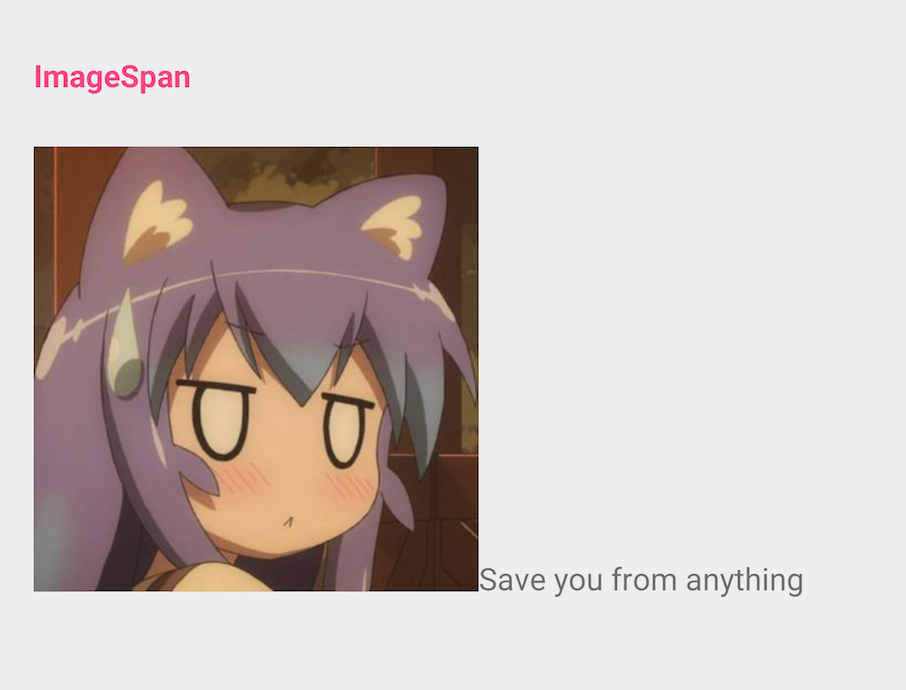

## Android中各种Span的用法
- <a href="#SpannableStringBuilder">SpannableStringBuilder</a>
- <a href="#URLSpan">URLSpan</a>
- <a href="#ForegroundColorSpan">ForegroundColorSpan</a>
- <a href="#BackgroundColorSpan">BackgroundColorSpan</a>
- <a href="#UnderlineSpan">UnderlineSpan</a>
- <a href="#TypefaceSpan">TypefaceSpan</a>
- <a href="#TextAppearanceSpan">TextAppearanceSpan</a>
- <a href="#SuperscriptSpan">SuperscriptSpan</a>
- <a href="#SubscriptSpan">SubscriptSpan</a>
- <a href="#StrikethroughSpan">StrikethroughSpan</a>
- <a href="#ScaleXSpan">ScaleXSpan</a>
- <a href="#StyleSpan">StyleSpan</a>
- <a href="#RelativeSizeSpan">RelativeSizeSpan</a></a>
- <a href="#AbsoluteSizeSpan">AbsoluteSizeSpan</a>
- <a href="#MaskFilterSpan">MaskFilterSpan</a>
- <a href="#LeadingMarginSpan">LeadingMarginSpanStandard</a>
- <a href="#ImageSpan">ImageSpan</a>
- <a href="#IconMarginSpan">IconMarginSpan</a>
- <a href="#DrawableMarginSpan">DrawableMarginSpan</a>
- <a href="#BulletSpan">BulletSpan</a>
- <a href="#QuoteSpan">QuoteSpan</a>
- <a href="#TabStopSpan">TabStopSpanStandard</a>
- <a href="#AlignmentSpan">AlignmentSpanStandard</a>
- <a href="#ClickableSpan">ClickableSpan</a>


### 前言
在`android.text.style`包下，有一些Span类，可以提供我们完成一些在TextView中的特殊内容。（比如：部分内容颜色、字体、大小不同等等，更有部分字体可点击。）

还有一个`SpannableStringBuilder`，可以帮助我们设置Span。

-------------

### <a name="SpannableStringBuilder">SpannableStringBuilder</a>
`SpannableStringBuilder`可以方便我们更好的设置上对应的Span。

##### 设置Span
`SpannableStringBuilder.setSpan(Object what, int start, int end, int flags)`

这里的Flag表示：start和end是开区间还是闭区间。

Flag:
- `Spanned.SPAN_EXCLUSIVE_EXCLUSIVE` —— (a,b)
- `Spanned.SPAN_EXCLUSIVE_INCLUSIVE` —— (a,b]
- `Spanned.SPAN_INCLUSIVE_EXCLUSIVE` —— [a,b)
- `Spanned.SPAN_INCLUSIVE_INCLUSIVE` —— [a,b]

---------

### <a name="URLSpan">URLSpan</a>
功能：点击文字，可以打开一个URL。

`URLSpan(String url)`
```java
SpannableStringBuilder ssb = new SpannableStringBuilder(content);
ssb.setSpan(new URLSpan("https://github.com/CaMnter"), start, sub.length(), Spanned.SPAN_INCLUSIVE_INCLUSIVE);
contentTV.setText(ssb);
// 在单击链接时凡是有要执行的动作，都必须设置MovementMethod对象
contentTV.setMovementMethod(LinkMovementMethod.getInstance());
// 设置点击后的颜色，这里涉及到ClickableSpan的点击背景
contentTV.setHighlightColor(0xff8FABCC);
```


-----------

### <a name="ForegroundColorSpan">ForegroundColorSpan</a>
功能：设置文字颜色。

`ForegroundColorSpan(@ColorInt int color)`
```java
SpannableStringBuilder ssb = new SpannableStringBuilder(content);
ssb.setSpan(new ForegroundColorSpan(0xff303F9F), start, start + sub.length(), Spanned.SPAN_INCLUSIVE_INCLUSIVE);
contentTV.setText(ssb);
```


-----------

### <a name="BackgroundColorSpan">BackgroundColorSpan</a>
功能：设置背景色。

`BackgroundColorSpan(int color)`
```java
SpannableStringBuilder ssb = new SpannableStringBuilder(content);
String you = "you";
int indexYou = content.indexOf(you);
ssb.setSpan(new BackgroundColorSpan(0x2f303F9F), start, start + sub.length(), Spanned.SPAN_EXCLUSIVE_EXCLUSIVE);
ssb.setSpan(new BackgroundColorSpan(0x2fFF4081), indexYou, indexYou + you.length(), Spanned.SPAN_EXCLUSIVE_EXCLUSIVE);
contentTV.setText(ssb);
```


-----------

### <a name="UnderlineSpan">UnderlineSpan</a>
功能：设置文字下划线。

`UnderlineSpan()`
```java
SpannableStringBuilder ssb = new SpannableStringBuilder(content);
ssb.setSpan(new UnderlineSpan(), start, start + sub.length(), Spanned.SPAN_INCLUSIVE_INCLUSIVE);
contentTV.setText(ssb);
```


---------------

### <a name="TypefaceSpan">TypefaceSpan</a>
功能：设置文字字体。

`TypefaceSpan(String family)`构造方法源码中的注释提示了三种系统字体：
- `monospace`
- `serif`
- `sans-serif`

```java
    /**
     * @param family The font family for this typeface.  Examples include
     * "monospace", "serif", and "sans-serif".
     */
    public TypefaceSpan(String family) {
        mFamily = family;
    }
```
```java
SpannableStringBuilder ssb = new SpannableStringBuilder(content);
ssb.setSpan(new TypefaceSpan("serif"), start, start + sub.length(), Spanned.SPAN_INCLUSIVE_INCLUSIVE);
contentTV.setText(ssb);
```


------------

### <a name="TextAppearanceSpan">TextAppearanceSpan</a>
功能：设置文字字体、文字样式（粗体、斜体、等等）、文字颜色状态、文字下划线颜色状态等等。

`TextAppearanceSpan`的三个构造方法
```java
TextAppearanceSpan(Context context, int appearance)

TextAppearanceSpan(Context context, int appearance, int colorList)

TextAppearanceSpan(String family, int style, int size,ColorStateList color, ColorStateList linkColor)
```

family:
- `monospace`
- `serif`
- `sans-serif`

style:
- `Typeface.NORMAL`
- `Typeface.BOLD`
- `Typeface.ITALIC`
- `Typeface.BOLD_ITALIC`

size:表示字体大小（单位px）
```java
SpannableStringBuilder ssb = new SpannableStringBuilder(content);
ColorStateList colorStateList = null;
if (Build.VERSION.SDK_INT >= Build.VERSION_CODES.M) {
    colorStateList = this.activity.getColorStateList(R.color.selector_apperarance_span);
} else {
    try {
        colorStateList = ColorStateList.createFromXml(this.activity.getResources(), this.activity.getResources().getXml(R.color.selector_apperarance_span));
    } catch (XmlPullParserException | IOException e) {
        e.printStackTrace();
    }
}
ssb.setSpan(new TextAppearanceSpan("serif", Typeface.BOLD_ITALIC, this.activity.getResources().getDimensionPixelSize(R.dimen.text_appearance_span), colorStateList, colorStateList), start, start + sub.length(), Spanned.SPAN_INCLUSIVE_INCLUSIVE);
contentTV.setText(ssb);
```


----------


### <a name="SuperscriptSpan">SuperscriptSpan</a>
功能：文字设置为上标，数学公式中用到。

`SuperscriptSpan(Parcel src)`
```java
SpannableStringBuilder ssb = new SpannableStringBuilder(content);
ssb.replace(start, start + sub.length(), "Save6");
Parcel parcel = Parcel.obtain();
parcel.writeInt(6);
int sixPosition = ssb.toString().indexOf("6");
ssb.setSpan(new SuperscriptSpan(parcel), sixPosition, sixPosition + 1, Spanned.SPAN_INCLUSIVE_INCLUSIVE);
parcel.recycle();
contentTV.setText(ssb);
```


--------


### <a name="SubscriptSpan">SubscriptSpan</a>
功能：文字设置为下标，化学式中用到。

`SubscriptSpan(Parcel src)`
```java
SpannableStringBuilder ssb = new SpannableStringBuilder(content);
ssb.replace(start, start + sub.length(), "Save6");
Parcel parcel = Parcel.obtain();
parcel.writeInt(6);
int sixPosition = ssb.toString().indexOf("6");
ssb.setSpan(new SubscriptSpan(parcel), sixPosition, sixPosition + 1, Spanned.SPAN_INCLUSIVE_INCLUSIVE);
parcel.recycle();
contentTV.setText(ssb);
```


---------------

### <a name="StrikethroughSpan">StrikethroughSpan</a>
功能：文字设置删除线。

`StrikethroughSpan()`
```java
SpannableStringBuilder ssb = new SpannableStringBuilder(content);
ssb.setSpan(new StrikethroughSpan(), start, start + sub.length(), Spanned.SPAN_INCLUSIVE_INCLUSIVE);
contentTV.setText(ssb);
```


-------

### <a name="ScaleXSpan">ScaleXSpan</a>
功能：文字横向缩放。

`ScaleXSpan(float proportion)`

proportion：缩放比例
```java
SpannableStringBuilder ssb = new SpannableStringBuilder(content);
ssb.setSpan(new ScaleXSpan(2.0f), start, start + sub.length(), Spanned.SPAN_INCLUSIVE_INCLUSIVE);
contentTV.setText(ssb);
```


--------

### <a name="StyleSpan">StyleSpan</a>
功能：文字设置样式（正常、粗体、斜体、粗斜体）。

`StyleSpan(int style)`

style:
- `Typeface.NORMAL`
- `Typeface.BOLD`
- `Typeface.ITALIC`
- `Typeface.BOLD_ITALIC`

```java
SpannableStringBuilder ssb = new SpannableStringBuilder(content);
ssb.setSpan(new StyleSpan(Typeface.BOLD_ITALIC), start, start + sub.length(), Spanned.SPAN_INCLUSIVE_INCLUSIVE);
contentTV.setText(ssb);
```


----------

### <a name="RelativeSizeSpan">RelativeSizeSpan</a>
功能：设置文字相对大小，指相对于文本设定的大小的相对比例。

`RelativeSizeSpan(float proportion)`

proportion：大小比例。
```java
SpannableStringBuilder ssb = new SpannableStringBuilder(content);
ssb.setSpan(new RelativeSizeSpan(6.0f), start, start + sub.length(), Spanned.SPAN_INCLUSIVE_INCLUSIVE);
contentTV.setText(ssb);
```


-----------

### <a name="AbsoluteSizeSpan">AbsoluteSizeSpan</a>
功能：设置文字绝对大小。

`AbsoluteSizeSpan(int size, boolean dip)`

size：默认单位为px。
dip：true为size的单位是dip，false为px。
```java
SpannableStringBuilder ssb = new SpannableStringBuilder(content);
ssb.setSpan(new AbsoluteSizeSpan(26, true), start, start + sub.length(), Spanned.SPAN_EXCLUSIVE_EXCLUSIVE);
contentTV.setText(ssb);
```


------

### <a name="MaskFilterSpan">MaskFilterSpan</a>
功能：设置文字模糊效果和浮雕效果。

`MaskFilterSpan(MaskFilter filter)`

MaskFilter：
- `BlurMaskFilter`： 模糊效果
- `EmbossMaskFilter`： 浮雕效果

```java
SpannableStringBuilder ssb = new SpannableStringBuilder(content);
MaskFilterSpan embossMaskFilterSpan = new MaskFilterSpan(new EmbossMaskFilter(new float[]{3, 3, 9}, 3.0f, 12, 16));
ssb.setSpan(embossMaskFilterSpan, start, start + sub.length(), Spanned.SPAN_INCLUSIVE_INCLUSIVE);
contentTV.setText(ssb);
String you = "you";
int indexYou = content.indexOf(you);
MaskFilterSpan blurMaskFilterSpan = new MaskFilterSpan(new BlurMaskFilter(3, BlurMaskFilter.Blur.OUTER));
ssb.setSpan(blurMaskFilterSpan, indexYou, indexYou + you.length(), Spanned.SPAN_INCLUSIVE_INCLUSIVE);
contentTV.setText(ssb);
```


-----------

### <a name="LeadingMarginSpan">LeadingMarginSpan.Standard</a>
功能：设置文本缩进。

`LeadingMarginSpan.Standard(int first, int rest)`

first：首行的 margin left 偏移量。
rest：其他行的 margin left 偏移量。
```java
SpannableStringBuilder ssb = new SpannableStringBuilder(content);
ssb.append(" ")
        .append(ssb.toString())
        .append(ssb.toString())
        .append(ssb.toString());
ssb.setSpan(new LeadingMarginSpan.Standard(96, 36), 0, ssb.length(), Spanned.SPAN_INCLUSIVE_INCLUSIVE);
contentTV.setText(ssb);
```


--------

### <a name="ImageSpan">ImageSpan</a>
功能：文本插入图片。

构造方法很多：
```
ImageSpan(Context context, Bitmap b)

ImageSpan(Context context, Bitmap b, int verticalAlignment)

ImageSpan(Drawable d)

ImageSpan(Drawable d, int verticalAlignment)

ImageSpan(Drawable d, String source)

ImageSpan(Drawable d, String source, int verticalAlignment)

ImageSpan(Context context, Uri uri)

ImageSpan(Context context, Uri uri, int verticalAlignment)

ImageSpan(Context context, @DrawableRes int resourceId)

ImageSpan(Context context, @DrawableRes int resourceId, int verticalAlignment)
```

verticalAlignment：
- `ImageSpan.ALIGN_BOTTOM`
- `ImageSpan.ALIGN_BASELINE`

source：图片的本机路径String。（ xxx/xxx/xxx.jpg ）

uri：图片的本机uri。
```java
SpannableStringBuilder ssb = new SpannableStringBuilder(content);
ssb.replace(start, start + sub.length(), " Save");
ssb.setSpan(new ImageSpan(this.activity, R.mipmap.ic_mm_1, ImageSpan.ALIGN_BASELINE), 0, 1, Spanned.SPAN_INCLUSIVE_INCLUSIVE);
contentTV.setText(ssb);
```



----------

### <a name="IconMarginSpan">IconMarginSpan</a>
功能：文本插入图片+Margin。

`IconMarginSpan(Bitmap b, int pad)`

pad：margin偏移量。
```java
SpannableStringBuilder ssb = new SpannableStringBuilder(content);
Bitmap bitmap = BitmapFactory.decodeResource(this.activity.getResources(), R.mipmap.ic_mm_1);
ssb.setSpan(new IconMarginSpan(bitmap, 60), 0, 1, Spanned.SPAN_EXCLUSIVE_EXCLUSIVE);
//bitmap.recycle();
contentTV.setText(ssb);
```


--------

### <a name="DrawableMarginSpan">DrawableMarginSpan</a>
功能：文本插入图片+Margin。

`DrawableMarginSpan(Drawable b, int pad)`

pad：margin偏移量。
```java
SpannableStringBuilder ssb = new SpannableStringBuilder(content);
ssb.setSpan(new DrawableMarginSpan(ResourcesUtil.getDrawable(this.activity, R.mipmap.ic_mm_1), 6), 0, 1, Spanned.SPAN_EXCLUSIVE_EXCLUSIVE);
contentTV.setText(ssb);
```


---------

### <a name="BulletSpan">BulletSpan</a>
功能：类似于HTML中的<li>标签的圆点效果。

`BulletSpan(int gapWidth, int color)`

gapWidth：圆点与文本的间距。

color：圆点颜色。
```java
SpannableStringBuilder ssb = new SpannableStringBuilder(content);
ssb.setSpan(new BulletSpan(66, 0xff303F9F), start, start + sub.length(), Spanned.SPAN_EXCLUSIVE_EXCLUSIVE);
contentTV.setText(ssb);
```


----------

### <a name="QuoteSpan">QuoteSpan</a>
功能：设置文字左侧显示引用样式（一条竖线）。

`QuoteSpan(@ColorInt int color)`

color：竖线的颜色。
```java
SpannableStringBuilder ssb = new SpannableStringBuilder(content);
ssb.setSpan(new QuoteSpan(0xff000000), start, start + sub.length(), Spanned.SPAN_INCLUSIVE_INCLUSIVE);
contentTV.setText(ssb);
```


---------------

### <a name="TabStopSpan">TabStopSpan.Standard</a>
功能：每行的MarginLeft的偏移量（跟 \t 和 \n 有关系）。

`TabStopSpan.Standard(int where)`
```java
SpannableStringBuilder ssb = new SpannableStringBuilder(content);
String[] subs = content.split(" ");
ssb = new SpannableStringBuilder();
/**
 * TabStopSpan. Standard related to \t and \n
 * TabStopSpan.Standard 跟 \t 和 \n 有关系
 */
for (String sub1 : subs) {
    ssb.append("\t").append(sub1).append(" ");
    ssb.append("\n");
}
ssb.setSpan(new TabStopSpan.Standard(126), 0, ssb.length(), Spanned.SPAN_INCLUSIVE_INCLUSIVE);
contentTV.setText(ssb);
```


-------

### <a name="AlignmentSpan">AlignmentSpan.Standard</a>
功能：设置文字对齐方式。

`AlignmentSpan.Standard(Layout.Alignment align)`

align：
- `Layout.Alignment.ALIGN_NORMAL`
- `Layout.Alignment.ALIGN_OPPOSITE`
- `Layout.Alignment.ALIGN_CENTER`
- `Layout.Alignment.ALIGN_LEFT`
- `Layout.Alignment.ALIGN_RIGHT`

```java
SpannableStringBuilder ssb = new SpannableStringBuilder(content);
ssb.setSpan(new AlignmentSpan.Standard(Layout.Alignment.ALIGN_CENTER), 0, ssb.length(), Spanned.SPAN_EXCLUSIVE_EXCLUSIVE);
contentTV.setText(ssb);
```

-------

### <a name="ClickableSpan">ClickableSpan</a>
功能：文字可点击。

抽象类，需要自己扩展实现。

ClickableSpanNoUnderline
```java
public class ClickableSpanNoUnderline extends ClickableSpan {

    private static final String TAG = "ClickableSpan";

    private static final int NO_COLOR = -206;
    private int color;

    private OnClickListener onClickListener;

    public ClickableSpanNoUnderline(int color, OnClickListener onClickListener) {
        super();
        this.color = color;
        this.onClickListener = onClickListener;
    }

    public ClickableSpanNoUnderline(OnClickListener onClickListener) {
        this(NO_COLOR, onClickListener);
    }

    /**
     * Makes the text underlined and in the link color.
     *
     * @param ds
     */
    @Override
    public void updateDrawState(@NonNull TextPaint ds) {
        super.updateDrawState(ds);
        // 设置文字颜色
        if (this.color == NO_COLOR) {
            ds.setColor(ds.linkColor);
        } else {
            ds.setColor(this.color);
        }
        ds.clearShadowLayer();
        // 去除下划线
        ds.setUnderlineText(false);
        ds.bgColor = Color.TRANSPARENT;
    }

    /**
     * Performs the click action associated with this span.
     *
     * @param widget widget
     */
    @Override
    public void onClick(View widget) {
        if (this.onClickListener != null) {
            this.onClickListener.onClick(widget, this);
        } else {
            Log.w(TAG, "listener was null");
        }
    }

    /**
     * 回调接口，回调自身的onClick事件
     * 告诉外部 是否被点击
     */
    public interface OnClickListener<T extends ClickableSpanNoUnderline> {
        /**
         * ClickableSpan被点击
         *
         * @param widget widget
         * @param span   span
         */
        void onClick(View widget, T span);
    }

}
```

SpanClickableSpan
```java
private class SpanClickableSpan extends ClickableSpanNoUnderline {

    private String urlString;

    public String getUrlString() {
        return urlString;
    }

    public void setUrlString(String urlString) {
        this.urlString = urlString;
    }

    public SpanClickableSpan(int color, OnClickListener onClickListener) {
        super(color, onClickListener);
    }

    public SpanClickableSpan(OnClickListener onClickListener) {
        super(onClickListener);
    }

}
```

开始使用
```java
SpannableStringBuilder ssb = new SpannableStringBuilder(content);
SpanClickableSpan spanClickableSpan = new SpanClickableSpan(0xffFF4081, new ClickableSpanNoUnderline.OnClickListener<SpanClickableSpan>() {
    /**
     * ClickableSpan被点击
     *
     * @param widget widget
     * @param span   span
     */
    @Override
    public void onClick(View widget, SpanClickableSpan span) {
        String urlString = span.getUrlString();
        if (TextUtils.isEmpty(urlString)) return;
        Uri uri = Uri.parse(urlString);
        Context context = widget.getContext();
        Intent intent = new Intent(Intent.ACTION_VIEW, uri);
        intent.putExtra(Browser.EXTRA_APPLICATION_ID, context.getPackageName());
        try {
            context.startActivity(intent);
        } catch (ActivityNotFoundException e) {
            Log.w("URLSpan", "Activity was not found for intent, " + intent.toString());
        }
    }
});
spanClickableSpan.setUrlString("https://github.com/CaMnter");
ssb.setSpan(spanClickableSpan, start, start + sub.length(), Spanned.SPAN_EXCLUSIVE_EXCLUSIVE);
contentTV.setText(ssb);
// 在单击链接时凡是有要执行的动作，都必须设置MovementMethod对象
contentTV.setMovementMethod(LinkMovementMethod.getInstance());
// 设置点击后的颜色，这里涉及到ClickableSpan的点击背景
contentTV.setHighlightColor(0x00000000);
```
----------------------

[Android中各种Span的用法](https://blog.csdn.net/qq_16430735/article/details/50427978)
