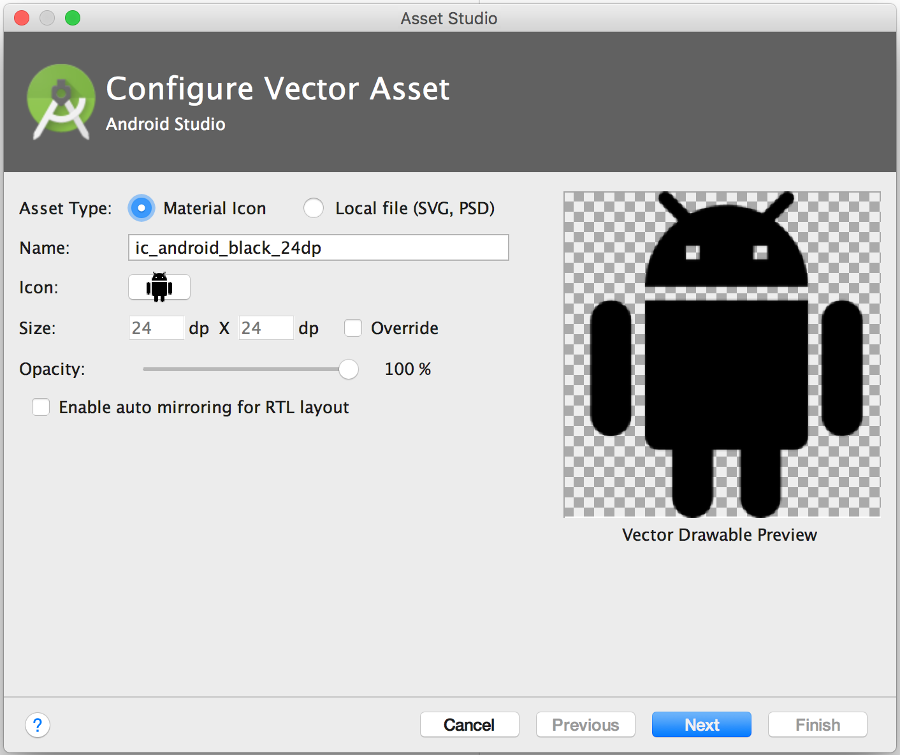
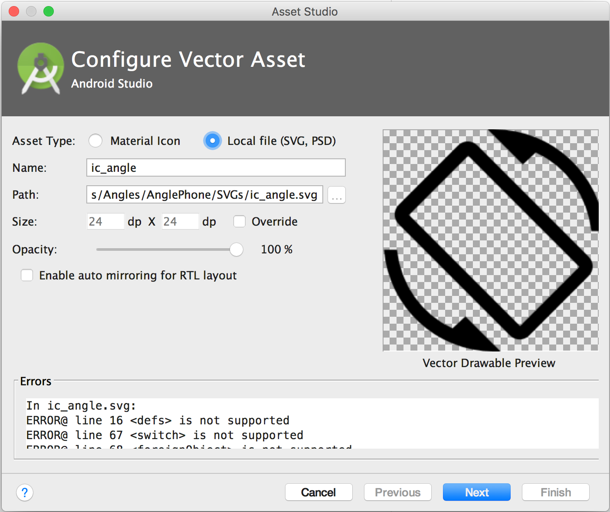
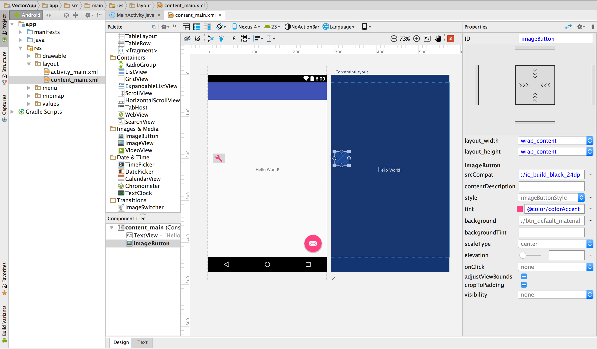
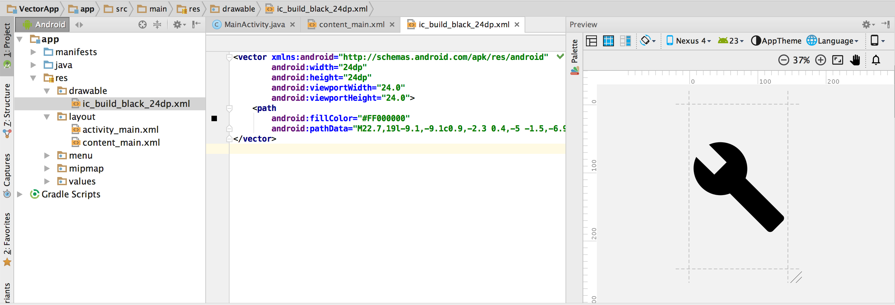
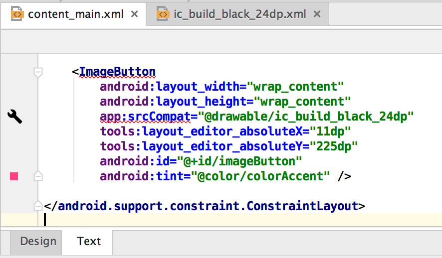

## 添加多密度矢量图形
Android Studio 包含一个名为 Vector Asset Studio 的工具，可帮助您添加 Material 图标以及将可扩展矢量图形 (SVG) 和 Adobe Photoshop Document (PSD) 文件作为矢量图资源导入到项目中。使用矢量图代替位图可以减小 APK 的尺寸，因为可以针对不同屏幕密度调整同一文件的大小，而不会降低图像质量。对于不支持矢量图的较早版本 Android 系统，Vector Asset Studio 可在构建时针对每种屏幕密度将矢量图转换为不同大小的位图。

### 关于 Vector Asset Studio
Vector Asset Studio 会将矢量图形作为描述图像的 XML 文件添加到项目中。与更新多个不同分辨率的光栅图形相比，维护一个 XML 文件可能会更加轻松一些。

Android 4.4（API 级别 20）及更低版本不支持矢量图。如果最低 API 级别设置为上述 API 级别之一，则在使用 Vector Asset Studio 时您有两个选择：生成便携式网络图形 (PNG) 文件（默认）或使用支持库。

为实现向后兼容性，Vector Asset Studio 会生成矢量图的光栅图像。矢量和光栅图一起打包到 APK 中。您可以在 Java 代码中以 Drawable 的形式引用矢量图，或在 XML 代码中以 @drawable 的形式引用矢量图；当您的应用运行时，对应的矢量或光栅图像会自动显示，具体取决于 API 级别。

如果您只想使用矢量图，可以使用 Android 支持库 23.2 或更高版本。要使用此技术，您需要在运行 Vector Asset Studio 之前按照支持库向后兼容性中的说明更改 build.gradle 文件。利用支持库中的 [`VectorDrawableCompat`](https://developer.android.com/reference/android/support/graphics/drawable/VectorDrawableCompat.html) 类，可实现在 Android 2.1（API 级别 7）及更高版本中支持 VectorDrawable。

### 支持的矢量图形类型
Google Material Design 规范提供了 [Material 图标](https://www.google.com/design/icons)，您可以在自己的 Android 应用中使用这些图标。Vector Asset Studio 可帮助您选择、导入 Material 图标和调整其大小，以及定义不透明度和从右到左 (RTL) 的镜像设置。

Vector Asset Studio 还让您可以导入自己的 SVG 和 PSD 文件。SVG 是万维网联盟 (W3C) 制定的一个基于 XML 的开放式标准。PSD 文件格式支持 Adobe Photoshop 功能。Vector Asset Studio 支持必要的标准，但并非支持所有 SVG 和 PSD 功能。在您指定 SVG 或 PSD 文件时，Vector Asset Studio 会立即提供是否支持图形代码的反馈。它将此文件转换为包含 VectorDrawable 代码的 XML 文件。如果您收到错误，应验证矢量图是否像预期一样显示。如需了解有关允许的 PSD 功能的详细信息，请参阅对 PSD 文件的支持和限制。

对于 Android 5.0（API 级别 21）及更高版本，您可以使用 [`AnimatedVectorDrawable`](https://developer.android.com/reference/android/graphics/drawable/AnimatedVectorDrawable.html) 类为 [`VectorDrawable`](https://developer.android.com/reference/android/graphics/drawable/VectorDrawable.html) 类的属性添加动画。有了支持库，您可以使用 AnimatedVectorDrawableCompat 类为 Android 3.0（API 级别 11）及更高版本的 VectorDrawable 类添加动画。如需了解详细信息，请参阅为矢量图添加动画。

#### SVG 和 PSD 文件注意事项
矢量图适用于简单的图标。Material 图标是适合在应用中用作矢量图的图像类型的一个好例子。相比之下，许多应用的启动图标包含许多细节，因此更适合用作光栅图像。

与对应的光栅图像相比，矢量图首次加载时可能消耗更多的 CPU 资源。之后，二者的内存使用率和性能则不相上下。我们建议您将矢量图像限制为最大 200 x 200 dp；否则，绘制它可能需要耗费很长的时间。

尽管矢量图确实支持一种或多种颜色，但在很多情况下，最好将图标设置为黑色 (`android:fillColor="#FF000000"`)。通过此方法，您可以为布局中放置的矢量图添加 tint 属性，图标颜色将随之变为 tint 颜色。如果图标颜色不是黑色，图标颜色可能反而与 tint 颜色较为搭配。

#### 矢量图向后兼容性解决方案
下表归纳了可用于实现向后兼容性的两种技术：

|技术 |	APK 中的可绘制资源 |	XML VectorDrawable 元素 |	版本 |	版本号标志|	应用代码 |
|-----|-----|-----|------|-------|----|
|PNG生成	|矢量和光栅	|支持的子集	|SVG：适用于 Gradle 的 Android 插件 1.5.0 或更高版本<br><br>PSD：Android Studio 2.2 或更高版本|默认	|支持的各种编码技术
|支持库 23.2 或更高版本|	矢量|	完全支持|	适用于 Gradle 的 Android 插件 2.0 或更高版本|	需要支持库声明|	支持的编码技术子集

使用矢量图可以生成更小的 APK，但首次加载矢量图可能需要较长时间。

#### PNG 生成
Android 5.0（API 级别 21）及更高版本会提供矢量图支持。如果应用的最低 API 级别低于以上版本，Vector Asset Studio 会将矢量图文件添加到项目中；另外，在构建时，Gradle 会创建不同分辨率的 PNG 光栅图像。Gradle 会生成 build.gradle 文件中的域特定语言 (DSL) `generatedDensities` 属性所指定的 PNG 密度。

对于 Android 5.0（API 级别 21）及更高版本，Vector Asset Studio 支持所有 `VectorDrawable` 元素。为向后兼容 Android 4.4（API 级别 20）及更低版本，Vector Asset Studio 支持以下 XML 元素：

|`<vector>` | `<group>` |`<path>`|
|-----|-----|----|
|android:width<br>android:height<br>android:viewportWidth<br>android:viewportHeight<br>android:alpha|android:rotation<br>android:pivotX<br>android:pivotY<br>android:scaleX<br>android:scaleY<br>android:translateX<br>android:translateY|android:pathData<br>android:fillColor<br>android:strokeColor<br>android:strokeWidth<br>android:strokeAlpha<br>android:fillAlpha<br>android:strokeLineCap<br>android:strokeLineJoin<br>android:strokeMiterLimit

仅 Android 5.0（API 级别 21）及更高版本支持动态属性，例如 android:fillColor="?android:attr/colorControlNormal"。

您可以更改 Vector Asset Studio 生成的 XML 代码，但是最好不要这么做。更改代码中的值应该不会导致任何问题，但前提是这些值是有效的静态值。如果您要添加 XML 元素，必须确保根据您的最低 API 级别支持这些元素。

##### 支持库
此技术需要 Android 支持库 23.2 或更高版本、适用于 Gradle 的 Android 插件 2.0 或更高版本，且仅使用矢量图。利用支持库中的 [`VectorDrawableCompat`](https://developer.android.com/reference/android/support/graphics/drawable/VectorDrawableCompat.html) 类，可实现在 Android 2.1（API 级别 7）及更高版本中支持 VectorDrawable。

在使用 Vector Asset Studio 之前，您必须向 build.gradle 文件添加一条声明：
```xml
android {
  defaultConfig {
    vectorDrawables.useSupportLibrary = true
  }
}

dependencies {
  compile 'com.android.support:appcompat-v7:23.2.0'
}
```
您还必须使用与支持库兼容的编码技术，例如对矢量图使用 app:srcCompat 属性，而不是 android:src 属性。如需了解详细信息，请参阅 [Android 支持库 23.2](https://android-developers.blogspot.com/2016/02/android-support-library-232.html)。

### 运行 Vector Asset Studio
要启动 Vector Asset Studio，请：
- 在 Android Studio 中，打开 Android 应用项目。
- 在 Project 窗口中，选择 Android 视图。
- 右键点击 res 文件夹，然后选择 New > Vector Asset。
一些其他项目视图和文件夹也具有此菜单项。
此时将显示 Vector Asset Studio。<br>

<br>图 1. Vector Asset Studio。

- 如果反而出现 Need Newer Android Plugin for Gradle 对话框，请按如下步骤更正 Gradle 版本：
 - 选择 File > Project Structure。
 - 在 Project Structure 对话框中，选择 Project。
 - 在 Android Plugin Version 字段中，将适用于 Gradle 的 Android 插件版本更改为 1.5.0 或更高版本，然后点击 OK。
Gradle 将同步项目。
 - 在 Project 窗口的 Android 视图中，右键点击 res 文件夹，然后选择 New > Vector Asset。
此时将显示 Vector Asset Studio。

- 继续导入矢量图形。


#### 导入矢量图形
Vector Asset Studio 可帮助您将矢量图形文件导入至应用项目中。按照以下步骤之一操作：
- 添加 Material 图标
- 导入 SVG 或 PSD 文件

#### 添加 Material 图标
[打开 Vector Asset Studio](https://developer.android.com/studio/write/vector-asset-studio#running) 后，您可以按照如下步骤添加 Material 图标：
- 在 Vector Asset Studio 中，选择 Material Icon。
- 在“Icon”字段中点击此按钮。
- 在 Select Icon 对话框中，选择一个 Material 图标并点击 OK。
此图标将出现在 Vector Drawable Preview 中。

- 可以选择更改资源名称、尺寸、不透明度和从右到左 (RTL) 的镜像设置：
 - Name - 如果您不想使用默认名称，可键入新名称。如果项目中已存在此资源名称，Vector Asset Studio 会自动创建一个唯一的名称（在名称末尾添加一个数字）。名称只能包含小写字符、下划线和数字。
 - Override - 如果您想要调整图像的尺寸，请选择此选项。键入新尺寸后，会在预览区显示变化。
默认为 24 x 24 dp，此值在材料设计规范中定义。取消选中此复选框可恢复默认值。

 - Opacity - 使用滑块调整图像的不透明度。在预览区中会显示变化。
Enable auto mirroring for RTL layout - 如果您希望在布局为从右到左（而不是从左到右）时显示镜像，请选择此选项。例如，某些语言是从右到左书写；如果有箭头图标，在此情况下，您可能需要显示此图标的镜像。请注意，如果您正在处理之前的项目，您还可能需要向应用清单添加 `android:supportsRtl="true"`。Android 5.0（API 级别 21）及更高版本以及支持库均支持自动镜像。
- 点击 Next。
- 可以选择更改模块和资源目录：
 - Res Directory - 选择您要向其中添加矢量图的资源源集（src/main/res、src/debug/res 和 src/release/res）或用户定义的源集。主源集适用于包括调试和发行源集在内的所有构建变体。调试和发行源集将替换主源集，并应用于某个构建版本。调试源集仅适用于调试。要定义新源集，请选择 `File > Project Structure > app > Build Types`。例如，您可以定义测试版源集，创建一种在右下角包含文本“BETA”的图标。如需了解详细信息，请参阅配置构建变体。
Output Directories 区域显示矢量图及其出现的目录。

- 点击 Finish。
Vector Asset Studio 将定义矢量图的 XML 文件添加到项目的 `app/src/main/res/drawable/` 文件夹中。在 Project 窗口的 Android 视图中，您可以在 drawable 文件夹中查看生成的矢量 XML 文件。

- 构建项目。
如果最低 API 级别为 Android 4.4（API 级别 20）及更低版本，且您未启用支持库技术，则 Vector Asset Studio 将生成 PNG 文件。在 Project 窗口的 Project Files 视图中，您可以在 app/build/generated/res/pngs/debug/ 文件夹中查看生成的 PNG 和 XML 文件。<br>
您不应编辑这些生成的光栅文件，但应改用矢量 XML 文件。构建系统会在必要时自动重新生成光栅文件，因此，您无需维护这些文件。


##### 导入 SVG 或 PSD 文件
打开 Vector Asset Studio 后，您可以按照如下步骤导入 SVG 或 PSD 文件：

- 在 Vector Asset Studio 中，选择 Local file。
此文件必须位于本地驱动器上。例如，如果文件位于网络上，您需要首先将其下载到本地驱动器。

- 点击 … 指定一个图像文件。
此图像将出现在 Vector Drawable Preview 中。<br>
如果 SVG 或 PSD 文件包含不受支持的功能，将在 Vector Asset Studio 的底部显示一个错误，如图 2 所示。
<br>图 2. Vector Asset Studio 显示某些错误。<br>
如果您看到错误，需要确保导入的矢量图正确渲染。滚动列表以查看错误。<br>
如需支持的元素列表，请参阅矢量图向后兼容性解决方案。如需了解有关允许的 PSD 文件的详细信息，请参阅对 PSD 文件的支持和限制。

- 可以选择更改资源名称、尺寸、不透明度和从右到左 (RTL) 的镜像设置：
 - Name - 如果您不想使用默认名称，可键入新名称。如果项目中已存在此资源名称，Vector Asset Studio 会自动创建一个唯一的名称（在名称末尾添加一个数字）。名称只能包含小写字符、下划线和数字。
 - Override - 如果您想要调整图像的尺寸，请选择此选项。选择此选项后，尺寸将变为图像本身的尺寸。每当更改尺寸时，都会在预览区显示变化。默认为 24 x 24 dp，此值在材料设计规范中定义。
 - Opacity - 使用滑块调整图像的不透明度。在预览区中会显示变化。
 - Enable auto mirroring for RTL layout - 如果您希望在布局为从右到左（而不是从左到右）时显示镜像，请选择此选项。例如，某些语言是从右到左书写；如果有箭头图标，在此情况下，您可能需要显示此图标的镜像。请注意，如果您正在处理之前的项目，您可能需要向应用清单添加 android:supportsRtl="true"。Android 5.0（API 级别 21）及更高版本以及支持库支持自动镜像。
- 点击 Next。
- 可以选择更改资源目录：
 - Res Directory - 选择您要向其中添加矢量图的资源源集（src/main/res、src/debug/res 和 src/release/res）或用户定义的源集。主源集适用于包括调试和发行源集在内的所有构建变体。调试和发行源集将替换主源集，并应用于某个构建版本。调试源集仅适用于调试。要定义新源集，请选择 File > Project Structure > app > Build Types。例如，您可以定义测试版源集，创建一种在右下角包含文本“BETA”的图标。如需了解详细信息，请参阅配置构建变体。
Output Directories 区域显示矢量图及其出现的目录。

- 点击 Finish。
Vector Asset Studio 将定义矢量图的 XML 文件添加到项目的 app/src/main/res/drawable/ 文件夹中。在 Project 窗口的 Android 视图中，您可以在 drawable 文件夹中查看生成的矢量 XML 文件。

- 构建项目。
如果最低 API 级别为 Android 4.4（API 级别 20）及更低版本，且您未启用支持库技术，则 Vector Asset Studio 将生成 PNG 文件。在 Project 窗口的 Project Files 视图中，您可以在 app/build/generated/res/pngs/debug/ 文件夹中查看生成的 PNG 和 XML 文件。<br>
您不应编辑这些生成的光栅文件，但应改用矢量 XML 文件。构建系统会在必要时自动重新生成光栅文件，因此，您无需维护这些文件。


### 向布局添加矢量图
在布局文件中，您可以将任何与图标有关的小部件（例如 ImageButton 和ImageView 等）设置为指向矢量图。例如，以下布局显示了一个按钮上显示的矢量图：<br><br>图 3. 某个布局中某个按钮上显示的矢量图。

要在小部件上显示图中所示的矢量图，请：

- 打开一个项目并导入矢量图。
本例使用通过“New Project Wizard”生成的“Phone/Tablet”项目。

- 在 Project 窗口的 Android 视图中，双击某个 XML 布局文件，例如 content_main.xml。
- 点击 Design 标签以显示 Layout Editor。
- 将 ImageButton 小部件从 Palette 窗口拖动到布局编辑器中。
- 在 Resources 对话框中，选择左侧窗格中的 Drawable，然后选择已导入的矢量图。点击 OK。
矢量图将出现在布局中的 ImageButton 上。

- 要将图像颜色更改为在主题中定义的强调色，请在 Properties 窗口中找到 tint 属性并点击 …。
- 在 Resources 对话框中，选择左侧窗格中的 Color，然后选择 colorAccent。点击 OK。
布局中的图像颜色将变为强调色。

如果项目使用支持库，ImageButton 代码应类似于下面这样：
```xml
<ImageButton
  android:layout_width="wrap_content"
  android:layout_height="wrap_content"
  app:srcCompat="@drawable/ic_build_black_24dp"
  tools:layout_editor_absoluteX="11dp"
  tools:layout_editor_absoluteY="225dp"
  android:id="@+id/imageButton"
  android:tint="@color/colorAccent" />
```
如果项目不使用支持库，则矢量图代码反而为 `android:src="@drawable/ic_build_black_24dp"`。

#### 在代码中引用矢量图
通常，您可以按照常规方式在代码中引用矢量图资源，当您的应用运行时，即会自动显示对应的矢量图像或光栅图像，具体取决于 API 级别：

- 在大多数情况下，您可以在 XML 代码中以 @drawable 的形式引用矢量图，或在 Java 代码中以 Drawable 的形式引用矢量图。
例如，以下布局 XML 代码会将图像应用于视图：
```xml
<ImageView
    android:layout_height="wrap_content"
    android:layout_width="wrap_content"
    android:src="@drawable/myimage" />
```
以下 Java 代码将图像作为 Drawable 进行检索：
```java
Resources res = getResources();
Drawable drawable = res.getDrawable(R.drawable.myimage);
```
`getResources()` 方法位于 Context 类中，适用于 UI 对象，如 Activity、片段、布局、视图，等等。

- 如果您的应用在任何情况下都可使用支持库（即使您的 build.gradle 文件中没有 vectorDrawables.useSupportLibrary = true 声明），您也可以通过 app:srcCompat 声明引用矢量图。例如：
```xml
<ImageView
    android:layout_height="wrap_content"
    android:layout_width="wrap_content"
    app:srcCompat="@drawable/myimage" />
```
- 有时，您可能需要确定可绘制资源类型所属的确切类，例如，当您需要使用 VectorDrawable 类的特定功能时。为此，您可以使用如下 Java 代码：
```java
if (Build.VERSION.SDK_INT >= Build.VERSION_CODES.LOLLIPOP) {
   VectorDrawable vectorDrawable =  (VectorDrawable) drawable;
} else {
   BitmapDrawable bitmapDrawable = (BitmapDrawable) drawable;
}
```
您仅可以从主线程访问矢量图资源。

对于支持库编码技术，您必须使用与支持库兼容的编码技术。如需了解详细信息，请参阅 Android 支持库 23.2。

#### 修改 Vector Asset Studio 生成的 XML 代码
您可以修改矢量图 XML 代码，但不能修改构建时生成的 PNG 和对应的 XML 代码。不过，我们并不建议这么做。

在使用 PNG 生成技术时，Vector Asset Studio 会确保矢量图和 PNG 匹配，并确保清单包含正确的代码。如果您添加 Android 4.4（API 级别 20）及更低版本不支持的代码，矢量图像和 PNG 图像可能不同。您还需要确保清单包含支持所做更改的代码。

要在未使用支持库技术的情况下修改矢量 XML 文件，请：

1. 在 Project 窗口中，在 drawable 文件夹中双击生成的矢量 XML 文件。
XML 文件将出现在编辑器和 Preview 窗口中。<br><br>图 4. 矢量 XML 文件显示在代码编辑器和“Preview”窗口中。

2. 根据最低 API 级别所支持的元素编辑 XML 代码：
 - Android 5.0（API 级别 21）及更高版本 - Vector Asset Studio 支持所有 Drawable 和 VectorDrawable 元素。您可以添加 XML 元素和更改值。
 - Android 4.4（API 级别 20）及更低版本 - Vector Asset Studio 支持所有 Drawable 元素和 VectorDrawable 元素的子集。如需相关列表，请参阅矢量图向后兼容性解决方案。您可以更改生成的代码中的值和添加支持的 XML 元素。不支持动态属性。
3. 构建项目，检查矢量图和对应的光栅图像外观是否相同。
请谨记，由于采用不同的渲染引擎和在构建前对矢量图进行了任何更改，生成的 PNG 在 Preview 窗口中可能与在应用中显示得不同。如果您向 Vector Asset Studio 创建的矢量 XML 文件添加代码，则生成的 PNG 文件中不会显示 Android 4.4（API 级别 20）中不受支持的任何功能。因此，在您添加代码时，应始终检查生成的 PNG 是否与矢量图匹配。为此，可在 Project 窗口的 Project Files 视图中双击此 PNG；当您的代码引用此图片时，代码编辑器的左边也会显示 PNG 图像，如图 5 所示。<br>图 5. PNG 图像显示在代码编辑器的左边。

### 从项目中删除矢量图
要从项目中删除矢量图，请：

1. 在 Project 窗口中，选择生成的矢量 XML 文件并按 Delete 键（或选择 Edit > Delete），以删除此文件。
此时将显示 Safe Delete 对话框。

2. 可以选择多种选项，以在项目中查找使用此文件的位置，然后点击 OK。
Android Studio 将从项目和驱动器中删除此文件。但是，如果您选择在项目中搜索使用此文件的位置，在找到部分位置后，您可以查看这些位置，再决定是否删除此文件。

3. 选择 Build > Clean Project。
将从项目和驱动器中删除任何自动生成的与删除的矢量图所对应的 PNG 和 XML 文件。

### 交付包含矢量图的应用
如果您使用支持库技术或最低 API 级别为 Android 5.0（API 级别 21）或更高版本，则 APK 将包含您使用 Vector Asset Studio 添加的矢量图。如果之前将矢量图转换为 PNG，这些 APK 的尺寸将会更小。

当最低 API 级别包含 Android 4.4（API 级别 20）或更低版本，且项目包含对应的矢量图和光栅图像时，您可以选择两种方式交付 APK 文件：

- 创建一个包含矢量图和对应的光栅图像的 APK。此解决方案最容易实现。
- 针对不同的 API 级别创建不同的 APK。如果未将对应的光栅图像包含到 Android 5.0（API 级别 21）及更高版本的 APK 中，将会大大减小 APK 的尺寸。如需了解详细信息，请参阅多 APK 支持。

### 对 PSD 文件的支持和限制
Vector Asset Studio 并非支持所有 PSD 文件功能。以下列表归纳了支持和不支持的 PSD 特性以及部分转换详情。

##### 文档
支持：
- 位图、灰度级、索引、RGB、Lab 或 CMYK 的 PSD 颜色模式。
- 8 位、16 位或 32 位颜色深度。
转换详情：
- PSD 文档尺寸变成矢量图和视口尺寸。

不支持：
- 双色调或多通道的 PSD 颜色模式。

##### 形状

支持：
- 剪切蒙版（如果剪切母版是其他形状）。
- 形状操作，包括合并/添加、相交、删减和排除。

不支持：
- Photoshop 形状使用的奇偶填充规则。在 Android 6.0（API 级别 23）及更低版本中，矢量图仅支持非零填充规则。在自相交形状中，此限制可能导致 PSD 和产生的矢量图之间出现渲染差异。要修复此问题，请将 `android:fillType="evenOdd"` 添加到矢量图中的形状上。例如：
```xml
<vector xmlns:android="https://schemas.android.com/apk/res/android"
    android:viewportHeight="168"
    android:height="24dp"
    android:viewportWidth="209"
    android:width="24dp">

    <path
        android:fillAlpha="1.0"
        android:fillColor="#000000"
        android:fillType="evenOdd"
        android:pathData="M24,58 L24,167 L114,167 L114,66 M64,1 L64,96 L208,96 L208,8 M1,97 L146,139 L172,47"/>
</vector>
```

##### 描边和填充
支持：
- 描边，包括颜色、不透明度、宽度、连接、端点、虚线和对齐。
- 单色填充和描边。
- 指定为 RGB、Lab 或 CMYK 的描边和填充颜色。

转换详情：
- 如果描边为虚线、使用剪切母版进行剪切或使用居中对齐以外的对齐方式，Vector Asset Studio 会将它转换为矢量图中的填充形状。

不支持：
- 单色以外的颜色填充和描边，例如渐变。

##### 不透明度
支持：
- 不透明度为 0 的形状图层。

转换详情：
- Vector Asset Studio 将填充不透明度与图层不透明度相乘，计算出填充 Alpha 值。
- 此工具将剪切母版（如果有剪切母版）的不透明度与填充 Alpha 值相乘，计算出最终的填充 Alpha 值。
- 此工具将描边不透明度与图层不透明度相乘，计算出描边 Alpha 值。
- 此工具将剪切母版（如果有剪切母版）的不透明度与描边 Alpha 值相乘，计算出最终的描边 Alpha 值。

##### 图层
支持：
- 任何可见的形状图层。

转换详情：
- Vector Asset Studio 将图层名称保存在矢量图文件中。

不支持：
- 图层效果。
- 调整和文本图层。
- 混合模式（忽略）。